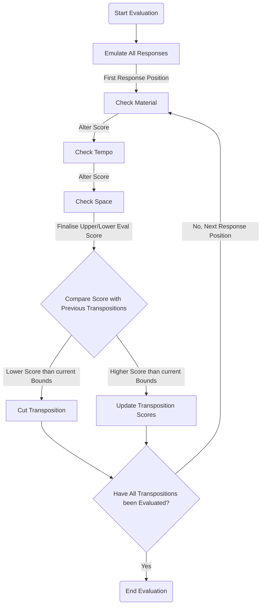
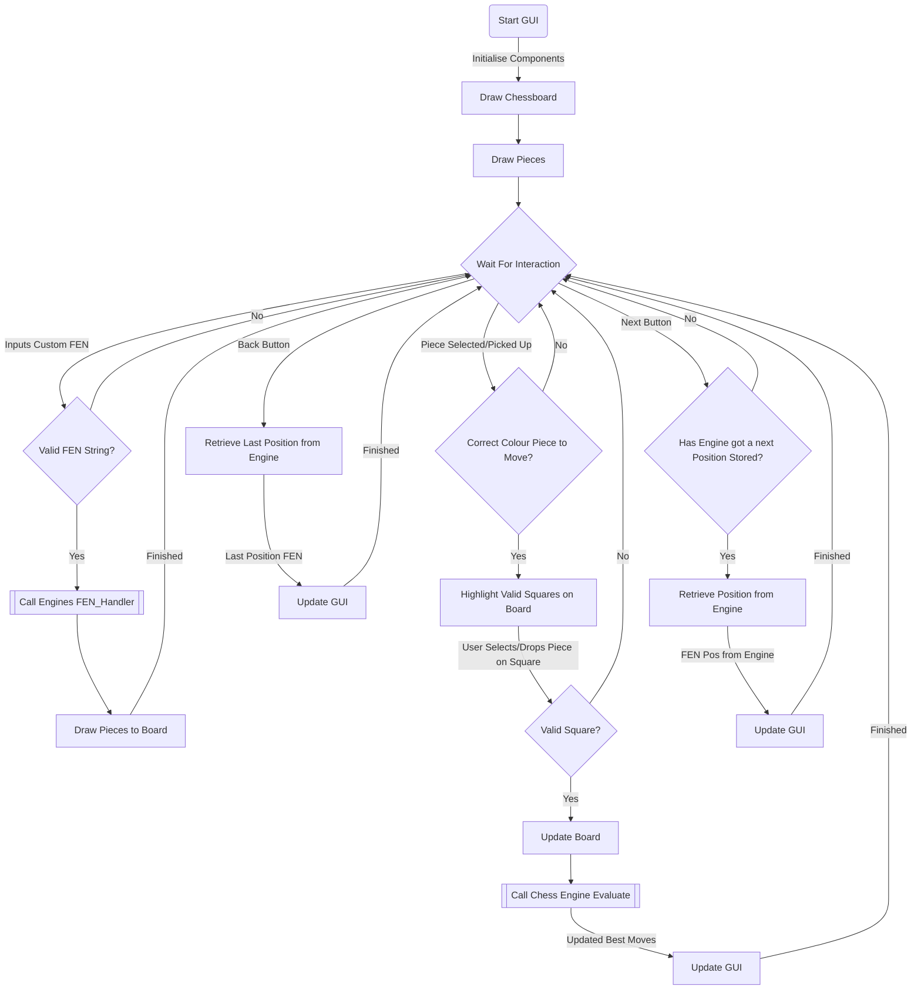
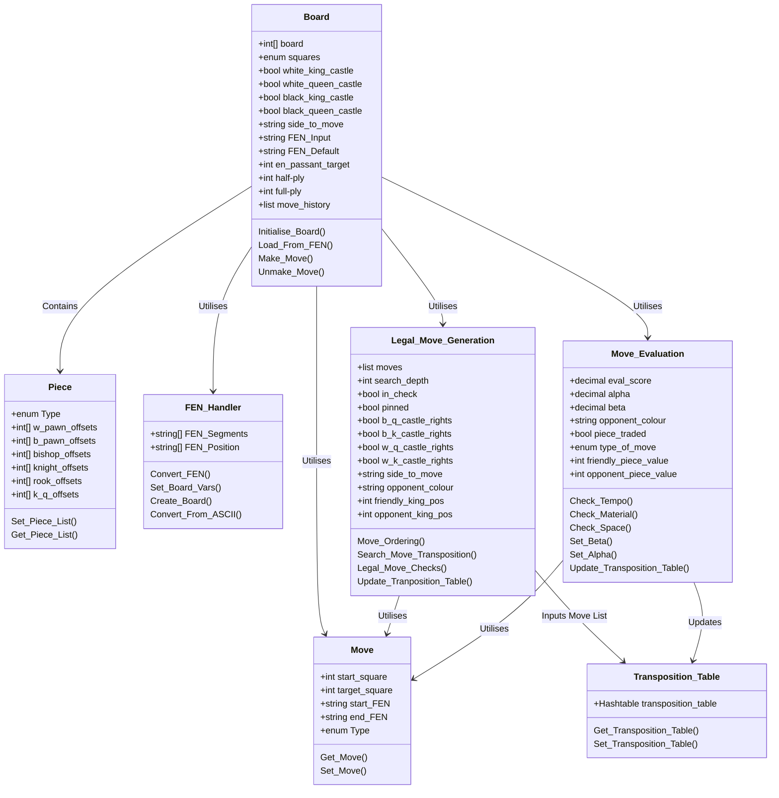

# IP40: The Individual Project Module (U10834) <!-- omit in toc -->
# Chess Engine Project <!-- omit in toc -->
## Will Castleman (wc104) <!-- omit in toc -->

## Table Of Contents <!-- omit in toc -->
- [Introduction and Idea (5marks)](#introduction-and-idea-5marks)
  - [Background to Problem](#background-to-problem)
  - [Justification to Task](#justification-to-task)
  - [Project Links](#project-links)
- [Project Analysis (20 Marks)](#project-analysis-20-marks)
  - [Stockfish - Basics](#stockfish---basics)
  - [Stockfish - Move Generation](#stockfish---move-generation)
  - [Stockfish - Move Evaluation](#stockfish---move-evaluation)
  - [Benefits of AI Neural Networks](#benefits-of-ai-neural-networks)
  - [Resource Estimation](#resource-estimation)
    - [Time Complexity](#time-complexity)
    - [Memory Requirements](#memory-requirements)
  - [Board Representation](#board-representation)
  - [Search Algorithm](#search-algorithm)
    - [Types of Search Algorithm](#types-of-search-algorithm)
    - [Search Trees](#search-trees)
    - [Cycles](#cycles)
    - [Transposition Table](#transposition-table)
    - [Alpha-Beta Algorithm](#alpha-beta-algorithm)
    - [Keeping a Minimal Search Tree](#keeping-a-minimal-search-tree)
  - [Evaluate Algorithm](#evaluate-algorithm)
    - [Basics](#basics)
    - [Piece-Square Tables](#piece-square-tables)
  - [Board Notation](#board-notation)
    - [FEN](#fen)
    - [PGN](#pgn)
    - [Alternatives](#alternatives)
- [Design (15 marks)](#design-15-marks)
  - [Language Choice](#language-choice)
  - [Design Pattern](#design-pattern)
  - [Board Representation](#board-representation-1)
  - [Program Flow](#program-flow)
    - [Engine](#engine)
      - [Search Algorithm](#search-algorithm-1)
      - [Evaluate Algorithm](#evaluate-algorithm-1)
    - [GUI Interface](#gui-interface)
- [Testing (15 marks)](#testing-15-marks)
  - [Development Lifecycle Choice](#development-lifecycle-choice)
- [Project Management(5 marks)](#project-management5-marks)
  - [Trello](#trello)
  - [GitHub](#github)
- [Conclusion (10 Marks)](#conclusion-10-marks)
  - [Critique of Work](#critique-of-work)
    - [Short Comings](#short-comings)
  - [Evaluation](#evaluation)
    - [Development Stories](#development-stories)
  - [Future Work](#future-work)
- [Appendix](#appendix)
  - [Appendix A: Engine Framework Flowchart](#appendix-a-engine-framework-flowchart)
  - [Appendix B: Engine Search Algorithm Flowchart](#appendix-b-engine-search-algorithm-flowchart)
  - [Appendix C: Engine Evaluate Algorithm Flowchart](#appendix-c-engine-evaluate-algorithm-flowchart)
  - [Appendix D: Graphical User Interface Project Flowchart](#appendix-d-graphical-user-interface-project-flowchart)
  - [Appendix X: Engine Class Diagram](#appendix-x-engine-class-diagram)
  - [Appendix X: Custom Text to Board Converter](#appendix-x-custom-text-to-board-converter)
  - [Appendix X: Example of a Unit test](#appendix-x-example-of-a-unit-test)
  - [Appendix X: Knight Valid Moves Function Test](#appendix-x-knight-valid-moves-function-test)
- [Glossary](#glossary)
- [Acknowledgements](#acknowledgements)
- [References](#references)

## Introduction and Idea (5marks)
### Background to Problem
This project is about creating a chess engine that will be able to play a decent game of chess by the end. Chess players would typically use it to analyse positions for insight. It may also train players up to a specific Elo rating, and finally, it could also be played for a bit of fun. It will be programmed in C# and will mainly run on a desktop computer, and if there is time at the end of the project, it will also be available to access on the web.

To tackle this project I will be using a test driven development approach. The project will be split into three; automated tests, the engine itself, and then the GUI. I will be using Trello to manage the project, and Although this will be a solo project, GitHub will be used to track changes to the project. 

### Justification to Task
I chose to take on this project not only because of my interest in the game itself; but also the personal growth and development I will get out of it as a programmer. It will be one of the most significant projects I have taken on solo. I will have to deep dive into some complex searches and evaluate algorithms that make up the main bulk of this project. The project is not only a task well suited to computers, but these algorithms' fundamental principles could be helpful in many other domains. Additionally, my time management and prioritisation skills will be challenged due to the different moving parts of this project.

One of the main reasons I chose this project was the advanced understanding I will develop due to deep-diving into researching these fundamental computing algorithms and concepts. There is also an enormous scope of other domains that benefit from applying these algorithms.   Examples of a few sectors which benefit from these algorithms include:
- Finance
- Chemical
- Gaming
- Databases and big data
- Travel

### Project Links
- [GITHUB](https://github.com/willcgg/Chess_Engine_Project)
- [TRELLO BOARD](https://trello.com/b/KsboK28s/project-backlog)

## Project Analysis (20 Marks)
Traditionally most chess engines follow the exact blueprint:
- Finding all legal candidate moves
- Iterating through a tree of potential moves to a given depth
- Assessing the tree to find the best move

An engines quality is usually evaluated based on two criteria:
- Speed - How fast it finds a list of potential 'good' moves
- Accuracy - How fast it finds the best move out of these moves

One of the first commercially available chess engines to exist by Dietrich Prinz (1951) on a Ferranti Mark 1 at the University of Manchester. The Ferranti Mark 1 lacked power, so it was limited because it could only find the best move when a position was two moves away from checkmate. The next engine the world saw was by a gentleman named Bernstein (1957). It was the first complete chess engine to run on a computer (IBM 704), which could play a game from start to finish, taking roughly 8 minutes to make a move. It was a type B implementation, a selective technique that attempts to cut processing times by examining variations as far as possible. Then only evaluating when a reasonable amount of instability in the position is detected. It then prunes unnecessary, redundant variations to cut processing times further. It is then run through a function to evaluate the position's stability (e.g. en prise). See Figure 1 for a "Crude definition" of this type of algorithm. (Bernstein, 2022; Chessprogramming.org, 2022)


Figure 1: A "Crude definition" of an en prise algorithm

Since then engines have developed significantly with engines such as:
- AlphaZero
- Stockfish
- Leela Chess Zero
- Houdini

Each demonstrates a different approach to the classic problem. Three of these engines were written in C++, while AlphaZero was developed in Python. Leela Chess Zero, much like AlphaZero, relies on AI and the use of a self-taught neural network to evaluate and generate the best moves. The engine plays against itself millions of times to teach itself the best move generation. These engines focus much more on selection/evaluation than on the 'winning routes' rather than the more typical brute force search we see in solutions like Stockfish. This project will look into more brute-force type algorithms with additional refining algorithms to 'trim' the search down. (Chess Engine | Top 10 Engines In The World, 2022)

### Stockfish - Basics
Stockfish, one of the most potent and well-known engines available to the public, was developed over several decades with the input from several chess grandmasters and many other sources. It used to be a classical brute force implementation that analysed millions of positions per second for optimal moves, defined by countless human input. However, since the famous loss against AlphaZero spoke about below, they implemented AI and machine learning aspects to enhance the engine further and cut processing times. (Champion, 2022)

Stockfish stores the board in a bitboard fashion with an array of 64 bits, with each representing a square on the board (see figure 2). If the bit representing a square has a value of one, there is a piece occupying it. This way, it is easy to represent a moved piece through bitwise operations: 
- One square forward: left shift of 8 bits
- One square left: left shift of 1 bit
- Retrieving all pieces currently on board: Logical OR of all the individual bitboards together
- Checking if a square is occupied: Logical AND of the bitboards with the positional mask of the selected square
- E.t.c...


Figure 2: Little-Endian File-Rank Mapping

### Stockfish - Move Generation
Next, I will go over how the engine generates its list of candidate moves. Some pieces, for example, the knight, have fixed candidate moves due to their movement, that being in an 'L' shape, with three squares forward and one square left (see Figure 3). (Champion, 2022)


Figure 3: Knight piece movement example

Variables containing bitshift operations are stored for knights' movement; they contain all eight operations required to move the knight in any direction. This works for most knight movements except for those where it is near a side of the board. A mask is applied to ensure no moves where the piece lands off the board are generated in these circumstances. A safe destination method is run after generating all pseudo-legal candidate moves to eliminate those that are invalid off-board positions. Pseudo legal move generators look for all empty square moves possible given a board position. It ignores most scenarios listed below. Once the moves have been generated, it runs a 'bool Position::legal(move m)' method alongside 'position.cpp', which tests whether the moves generated are legal. (Champion, 2022) The method checks for scenarios such as: 
- Blocking pieces 
- Discovered checks 
- Pinned pieces 
- E.t.c...

For the other sliding pieces: rooks, bishops, and the queen. Candidate moves are a little bit more problematic due to the sliding nature of the pieces' movement; they can move an indefinite amount of squares in their available attacking rays depending on whether a piece is blocking. To accomplish move generation of these pieces, a combination of the chosen pieces attacking rays and the complete board representation needed to be AND'd together to find these blocking pieces (see figure 4). Although this can be done in run-time for each piece and each attacking ray direction they can move, it is computationally expensive to do so. Therefore Stockfish uses a slightly more efficient method by using the look-up method in an array containing all the candidate moves for the sliding piece. However, finding all blockers for the piece is still required. (Champion, 2022)


Figure 4: Sliding piece move generation; blocking pieces

Once the blockers board has been found, Stockfish combines this with the existing array containing the candidate moves to generate the actual candidate moves for the piece (see figure 5 below).


Figure 5: Finding legal candidate moves for sliding pieces

However, this method has a problem because the blocker piece board is a 64-bit array. The array containing the candidate moves will have up to 264 elements. These combined works out at about one exabyte in size, much larger than any modern memory can hold at once. Stockfish uses a hashmap to store the candidate moves more memory efficiently to solve this issue. This brings the candidate move array down to only a few hundred kilobytes, easily handled by most modern computer systems. For a diagrammatic summary of all described above, see figure 6. (Champion, 2022)


Figure 6: Summary of Stockfishes process to generating a move list

### Stockfish - Move Evaluation
Once Stockfish has generated its set of possible legal moves, it needs to evaluate to return the best possible move for this set. Until 2018 when AlphaZero, spoken about below, drastically outperformed Stockfish, Stockfish relied solely on a classical evaluation of the position to retrieve the best move. Since then, they have integrated a neural network to assist in evaluations of more balanced positions to close the gap. For this next section, I will be focusing more on the classical evaluation and later look into the benefits brought by AI.

Without neural networks, Stockfish's classical evaluation relies on pro chess concepts such as:
- Tempo
- Material
- Space e.t.c

The evaluation function essentially combines chess concepts and strategies input by chess professionals and Grandmasters over several decades. It essentially evaluates things such as but not limited to the following parts along with examples:
- Material:
    - Imbalance - How many pieces left
    - Advantage - Strength of pieces e.g. bishop pair
    - Positional - How strong the pieces are in the current position
- Strategy
    - Advantage for pawns e.g. - Doubled pawns, isolated pawns, connected pawns, supported pawn structure, attacked pawns e.t.c
    - Advantage for pieces e.g. - Blocked pieces, bishop x-ray attacks, bishops on long diagonals such as C4 for light-squared bishop, trapping pieces, rook, and queen battery, keeping rooks on open files, forking pieces, e.t.c
- Space - Controlling more squares than the opponent
- King Safety - Looking out for incoming checks, keeping king 'sheltered' e.g. castling

This will make up the main bulk of what makes up these engines and what differentiates them from others; it essentially makes up the 'personality' of the engine and how it plays. Due to Stockfish's open-source nature, there have been countless pull requests just editing some of the weights and scores of some of these functions, which usually entails minor Elo rating improvements. (Champion, 2022)

### Benefits of AI Neural Networks
Historically some of the most potent engines have implemented aspects of AI, for instance, Google's AlphaZero, which introduced neural networks to the chess programming world. AI demonstrated its supremacy over other engines when it came out victorious in its hundred-game match against the well-known Stockfish 8. At the time of this match, it could beat even the top players in the world. This matchup was played with three hours of playtime with a 15-second increment. Both engines had time to evaluate positions thoroughly and to the best of their abilities, making any arguments of time limitations playing to either of the engine's disadvantages obsolete. (Pete, 2022)

AlphaZero even soundly won against the traditional engine in a series of time-odds matchups with a surprising time odds of 10:1. This means that AlphaZero even won with ten times less time than Stockfish (see figure 4). Furthermore, to take it further, the machine-learning engine even won matchups with a version of Stockfish with a "strong opening book". It did win a substantial number more games when AlphaZero was playing as black. However, it was not nearly enough to win the overall match (see Figure 5 for results). These victories over the strongest of traditional chess engines show just how powerful AI can be in both: 
- Evaluating moves 
- Searching for moves

DeepMind released information suggesting AlphaZero uses a Monte Carlo tree search algorithm to examine around 60,000 positions per second. Compared to Stockfishes, 60 million per second, demonstrating its much higher efficiency in generating its move set. (Pete, 2022)


Figure 7: AlphaZero's results in time odds match against Stockfish engine


Figure 8: AlphaZero's match-up results against Stockfish with a "strong opening book". Image by DeepMind.

These results safely conclude that AI and machine learning are superior to traditional engines and have solidified their place in the game and engines today. (Pete, 2022)

### Resource Estimation

#### Time Complexity

Take a starting chessboard, for example (see figure 9); for white, there are 20 total possible starting moves they can take. 2 possible moves for each of the pawns and 2 for both the knights ((8x2) + (2x2) = 20) then same for black. This means that after both players make their first move, there are 400 different possible positional outcomes. 


Figure 9: Starting chess position

After each move, there are more and more possibilities for where each player can move their pieces. This means the number of possible positions grows exponentially; to put this into perspective, see figure 10. Hence, we create trees to hold all the available moves down a given path. (Hercules, A., 2022)


Figure 10: Number of variations with incrementing the half-ply count

With these figures, it is possible to estimate how long the system will be able to calculate the best moves for a position x number of half-plys. For the following calculations, the assumptions made are that only one core running at 3GHz is being used to analyse a position. Roughly 1,000 instructions are being sent to the CPU to evaluate each position fully.
- 2 ply : ~ 0.0003s
- 3 ply : ~ 0.009s
- 4 ply : ~ 0.27s
- 5 ply : ~ 8.1s
- 6 ply : ~ 243s / 4m 3s
- 7 ply : ~ 7,290s / 2hrs 1m 30s
- 8 ply : ~ 218,700s / 60hrs 45m

#### Memory Requirements

Memory requirements are small for this project due to the algorithms used only usually keeping one branch of a search tree in memory at any one time. Most modern systems now, usually having giga bytes of RAM, will even not have any problems housing the entire transposition table aswell depending on the depth of the search used. (Search - Chessprogramming wiki, 2022)

### Board Representation
There are many ways to approach the board representation in this project such as:
- Piece Centric
  - Piece-Lists
  - Piece-Sets
  - Bitboards

These implementations typically hold a collection of pieces still on the board with information such as square occupied, typically held in lists or arrays. Doing it this way comes with the benefit of avoiding scanning the board for move generation purposes saving processing time. 
- Square Centric
  - Mailbox Approach
    - 8x8 Board
    - 10x12 Board
    - Vector attacks
    - 0x88

These types of implementations typically hold the opposite of piece-centric approaches in how they hold pieces of information on squares on the board. For example, an array of squares on the board is created to hold information on whether there is a piece occupying it or if it is empty.

- Hybrid Solutions

As discussed above, some of these types of implementations may also use elements of both of these types of implementation hence the 'hybrid'. Different search and evaluation functions tend to favour a specific representation; however, it is still common to see both in today's solutions.

### Search Algorithm

#### Types of Search Algorithm

For search algorithms, according to Claude Shannon, there are two types:
- Type A - More brute-force style of algorithm, looks at every possible variation to a given depth.
- Type B - More selective style approach only searching what it classes as a more 'important' branch of moves.

Up until the late 1970s most chess engines focused on type B implementations. However today, due to increase in average processing power, they tilt more towards type A implementations; for this project, I will be developing a type A implementation to generate the move list. 

Depth-first searches are often used in searching a transposition tree/table. They work by starting at the root node (The starting position) and explores out as far as possible or to the specified depth before backtracking and exploring the next branch. Additionally, these searches are typically embedded within an iterative deepening blueprint algorithm. These essentially work by starting with a 1 ply search then incrementing the search depth until a set timer goes off. In the event of the timer finishing before the current search is finished then it reverts back to the previous depths results. (Search - Chessprogramming wiki, 2022; Iterative Deepening - Chessprogramming wiki, 2022)

#### Search Trees

The search algorithm works by utilising a search tree which consists of nodes and edges representing alternating sides to moves and the connecting edges being the moves made by either side. The root of the search tree represents the current position to be searched and evaluated from to find the best move. (Search Tree - Chessprogramming wiki, 2022)

#### Cycles

Different variations of moves often end up at the same node, even in cases where they are from differing amount of moves made aka cycles. Due to the repetition rule, cycles are usually cut from the search tree, resulting in the search tree being more of a directed acrylic graph (See Figure X below). (Search Tree - Chessprogramming wiki, 2022)


Figure X: Directed acrylic graph example

#### Transposition Table

Transposition tables are used alongiside search functions, they are stored as hash tables which stores information on all branches of variations previously explored and their results. This is so these searches do not have to keep being re-done saving computation time. In cases where the depth of the information kept in the table is not enough, it provides useful insight; especially when it comes to move ordering. The main reason for implementing these is to save considerable search time.

Common hashing functions used alongside these tables include:
- Zobrist Hashing
- BCH Hashing
  
After a search has been run, these hash tables store information on: 
- Best move from position
- Depth of search
- Evaluation Score
- Age

All of which being potentially extremely useful when it comes to searching in the near future. (Transposition Table - Chessprogramming wiki, 2022)

#### Alpha-Beta Algorithm

Alpha-beta algorithms provide significant enhancements to the minmax algorithm by eliminating big sections of the game tree. It does this by maintaining two values for each branch; alpha and beta. These represent the minimum score that the current colour side can acquire and then hte maximum score. This works by take for example its whites turn to play and were using a depth of 2; 
- Consider all possible white moves
- Consider all possible response moves to each move

Firstly, we pick one of whites candidate moves then we consider every possible response by black and come up with an evaluation score for each. Say for example in one transposition it comes back with a lower bound evaluation score of even (~0). Then in another black ends up winning a rook, we can safely cut this move from the search tree as this is obviously not as good a move as the previous. This can be done without having to analyse any further possible responses from black due to the lower bound retrieved from the first transposition we evaluated. As you can imagine, from the previously discussed resource estimation section, this comes with considerable time 'savings' due to it no longer having to analyse every single move and counter move. (Alpha-Beta - Chessprogramming wiki, 2022)

Alpha-beta algorithms often utilise the following things to work:
- Iterative deepening (Discussed above)
- Transposition Table 
- Aspiration Windows (See Glossary)

#### Keeping a Minimal Search Tree

Minimizing a search tree is largely dependant on how good the move ordering of a search algorithm is. When best moves variations are searched for first there is often no need to store any other variations due to them usually being 'weaker' moves. Alhpa-beta pruning algorithm paired with the evaluation function attempts to solve this problem by utilising endgame tablebases. These are essentially big tables of precalculated moves generated by exhaustive retrograde analysis (See glossary). During an engines search & evaluation if it happens to notice certain material combinations it can effectively query this table to determine the outcomes of these positions definitively and act as a helper by providing optimal moves. (Endgame Tablebases - Chessprogramming wiki, 2022; Search Tree - Chessprogramming wiki, 2022)


Figure X: Alpha-Beta Search Tree example

### Evaluate Algorithm

#### Basics

Evaluation algorithms are typically heuristic functions which attempt to calculate the evaluation score of a certain position respective of the player. This score essentially represents each players chance at winning. The score generated is usually between 1 to -1, 1 being that white will certainly win the game, -1 being that black will certainly win the game, and 0 being a draw. If chess engines could 'see' a winning route from any postition this would either be a 1, -1 or a 0. This 'score' in practice is not known, therefore, we have to make a best approximation using pro chess concepts and comparing positions.

There are two main ways of building these algorithms:
- Traditional Pro Chess Concept Evaluation
- Multi-Layered Neural Network Evaluation

The most significant aspect of most traditional engines evalutaion score comes from the following:
- Material Balance
- Piece-Square Tables 
- Pawn Structure
- Evaluation of Pieces
- Mobility
- Center Control
- Connectivity
- Trapped Pieces
- King Safety
- Space
- Tempo

The first evaluation function ever written was by a man previously mentioned Claude Shannon in 1949. It essentially provides:
- A Symmetric evaluation from the side to moves perspective
- Score of the resulting position, NOT the actual move
  
Looked something like Figure X below.

```
f(p) = 200(K-K')
       + 9(Q-Q')
       + 5(R-R')
       + 3(B-B' + N-N')
       + 1(P-P')
       - 0.5(D-D' + S-S' + I-I')
       + 0.1(M-M') + ...

KQRBNP = number of kings, queens, rooks, bishops, knights and pawns
D,S,I = doubled, blocked and isolated pawns
M = Mobility (the number of legal moves)
```
Figure X: Claude Shannon Symmetric Evaluation Function

From this we can take that it essentially sums up all the pieces on the board compared with the opponent and multiplies them by their respective weighting for importance: king being most important, followed by queen, rook, bishops & knights (some engines value bishops higher), then finally pawns. After it has done this it then takes into consideration other important factors such as: doubled, blocked, and isolated pawns, and finally mobility of pieces which is measured by number of available legal moves. For an example of this see Figure X below.

```
materialScore = kingWt  * (wK-bK)
              + queenWt * (wQ-bQ)
              + rookWt  * (wR-bR)
              + knightWt* (wN-bN)
              + bishopWt* (wB-bB)
              + pawnWt  * (wP-bP)

mobilityScore = mobilityWt * (wMobility-bMobility)
```
Figure X: Basic Complete Evaluation Function

For this style of evaluation to work we need to ensure that the function looks from the correct sides perspective. For example, take the above evaluation function(Figure X), then apply a side_to_move variable (+1 for white, -1 for black) to return the correct eval score (See fugure X below).

```
Eval  = (materialScore + mobilityScore) * who2Move
```
Figure X: Eval Score taking into account side to move

(Evaluation - Chessprogramming wiki, 2022)

#### Piece-Square Tables

One of the simpler implementations of the eval function is utilising piece-square tables. To implement this is essentially just creating a table for each piece and colour, with values assigned to each square to represent 'good' squares to be on. This scheme is extremely useful as it can be:
- Incrementally updated as moves are made/unmade
- Hold scores for early game, mid game, and late game (See figure X below)

```
// knight
-50,-40,-30,-30,-30,-30,-40,-50,
-40,-20,  0,  0,  0,  0,-20,-40,
-30,  0, 10, 15, 15, 10,  0,-30,
-30,  5, 15, 20, 20, 15,  5,-30,
-30,  0, 15, 20, 20, 15,  0,-30,
-30,  5, 10, 15, 15, 10,  5,-30,
-40,-20,  0,  5,  5,  0,-20,-40,
-50,-40,-30,-30,-30,-30,-40,-50,
```
Figure X: Knight Piece-Square Table. Higher value = More valuable square for piece to occupy.

As you can see for the knights values, it is generally not a good idea to have knights on the edges of the board. They are best off middle of the board for higher coverage which is represented by higher scoring toward the centre. As can also be seen from the famous quote "knight on the rim is grim".

This technique is especially useful due to the dynamic nature of the tables, for example a pawn can have higher value later into the game then early game. Additionally, Utilising these piece-square tables is enough in itself to play a semi-decent game of chess. (Piece-Square Tables - Chessprogramming wiki, 2022)

### Board Notation

Board notations attempt to represent board states, there are two main chess board notations:
- Forsyth–Edwards Notation a.k.a. FEN
- Portable Game Notation a.k.a. PGN

Each have their own unique way of representing the board each with their own advantages and disadvantages.

#### FEN

Advantages:
- Holds all information on a specific position
- Position of pieces
- Whose move it is
- Castling rights
- En-passant target
- Half-ply count
- Full-ply count
- Smaller in size compared to PGN, one string of maximum 712 bits

Disadvantages:
- Only holds this information for one position, has no history of moves
- Doesn't hold any information on threefold repetition

```
rnbqkbnr/pppppppp/8/8/8/8/PPPPPPPP/RNBQKBNR w KQkq - 0 1
```
Figure X: FEN String Example

#### PGN

Advantages:
- Easy to read
- Holds information on an entire game; moves made, names of players, winner/loser, and even the date the game was played.

Disadvantages:
- Doesn't specifically hold information the same as FEN, you have to work it out from the moves played. Ie, castle rights, en-passant target e.t.c
- File sizes are much bigger due to increase in data needed

Example:

```
[Event "Chess.com Staff Tournament #2"]
[Site "Chess.com"]
[Date "2010.10.26"]
[White "ACEChess"]
[Black "piotr"]
[Result "1-0"]
[WhiteElo "2037"]
[BlackElo "2125"]
[TimeControl "1 in 3 days"]
[Termination "ACEChess won by resignation"]

1.e4 d5 2.exd5 Nf6 3.d4 Nxd5 4.c4 Nb6 5.Nc3 g6 6.Be3 Bg7 7.h3 O-O 8.Qd2 Nc6 9.Nf3 e5 10.d5 Ne7 11.g4 f5 12.O-O-O e4 13.Ng5 h6 14.Ne6 Bxe6 15.dxe6 Qxd2+ 16.Rxd2 Rad8 17.Bc5 Rxd2 18.Kxd2 Rd8+ 19.Kc2 Nc6 20.gxf5 Nd4+ 21.Bxd4 Rxd4 22.Rg1 g5 23.c5 Nc4 24.Bxc4 Rxc4 25.Rd1 Bf6 26.Kb3 Rxc5 27.Nxe4 Rxf5 28.Nxf6+ Kf8 29.Ng4 h5 30.Ne3 Rf3 31.Rd5 g4 32.hxg4 1-0
```
Figure X: PGN example from Chess.com archives

#### Alternatives

Alternatives to normal FEN include PGN, compressed FEN, and ųFEN. Alternatively, a custom conversion script to convert FENs to a human-readable text created a chessboard with ASCII pieces to clearly show the state to the user. This would probably be the least efficient way to go about it; however, it gives the project ease of readability. Therefore, testing will become a lot easier. (Keiter, 2015)

Compressed FEN could be good for saving bytes and be more memory efficient in the system. However, it does not meet project goals. It arguably is worse for humans to read than normal FEN, which is the purpose of this alternate board state storage. (Keiter, 2015)

ųFEN could be interesting as it considers a single square and its different states. There are 14 states with the different pieces, empty squares, and the blocker piece. This means the board could be represented in (4bits x 64 squares) 256bits. Compared with normal FEN, which has a worst-case scenario of 712 bits (r1b1k1n1/1p1p1p1p/p1p1p1p1/1n1q1b1r/R1B1P1N1/1P1P1P1P/P1P1K1P1/1N1Q1B1R w KQkq e3 999 999), almost 3 times less efficient. However, in practice, without compression techniques, which I do not wish to go into in this project, it ends up less memory efficient than compressed FEN. (Keiter, 2015)

PGN will need to be stored regardless, mainly to complete the functionality of the 'Next' and 'Back' buttons. This will be implemented through either a stack of all the moves made in the game or a list. Then when a user wishes to go back to a position, it will simply pop the top move off of the stack/list, which will be the last move played due to the stack's nature in storing data.

## Design (15 marks)

### Language Choice

The language I will be using to produce the engine will be C#. C# has several advantages, such as:
- Familiarity
- Portability
- Object-oriented nature
- Static language

The main difference between static typed languages vs dynamic typed languages is variables and the way that each handles them. With static languages, all variables and their types are already known at run time as the programmer, me, will have already declared them. This is advantageous as it means a lot of more trivial hard to detect bugs are caught early on.

On the other hand, dynamicly typed languages do not know the types assosciated with run time values/variables/fields e.t.c. Allowing programmers to skip the process of thinking about the type of each variable used. Although a lot of dynamicly typed languages also allow you to provide type information if required, for example to take care of a bug. Finding bugs inside bigger projects can be much more difficult. Hence, dynamic languages are mainly used as scripting languages due to their usefulness in developing solutions quickly and the much smaller nature of scripts compared to bigger projects. (Lynn, 2021)
  
Due to these, it is easier to find errors, understand the code, and write it. C#'s main advantage is that it is an object-oriented language; this makes the code 
- highly efficient
- Reusable
- Flexible
- Scalable
- Easy to maintain
 
Additionally, the chess programming world is primarily dominated by C and C++ languages, meaning a vast community of developers and resources are available. Some of the most robust engines written in other languages were eventually revised and developed in C. For example, Booot written by Alex Morozov in Delphi was rewritten due to running into too many 64-bit bugs. It is also commonly used for web and windows applications which fits the project's needs. 

### Design Pattern

To develop this project, I chose to use MVC Architecture, which was for several reasons which provide a significant advantage when developing this solution. It is often referred to as a design pattern; I have referred to it as an architectural pattern due to its application to structure my solution. It also helps:
- Creates a solid structure
- Helps reduce repetition


Figure 14: MVC Architecture

It comprises three parts: model, view, and controller—each with particular purposes and responsibilities.
- Model
  
  This section is responsible for handling and maintaining the data involved with the solution. In addition, it is the model that will typically connect to any databases/sources utilised within the solution.
- View
  
  This section displays the information from the model layer to the user. Developers often write the view in a friendly and easy to understand way. This layer also allows users to interact and change data for the controller to pass to the model to update the backend and then back to the controller to update the view once more.
- Controller
  
  Finally, this section is responsible for the data flow between the model and view components. It takes any changes from the view and passes them to the model to update and vice versa.

(Svirca, 2019; TutorialsPoint, 2022)

To make this project more manageable, instead of creating one titanic project, I split it up into three separate parts:
- Testing
  
  Testing is the part of the project that is responsible for ensuring the code stays bug/error-free. It is vital to write bug-free code at the start of a project. There will more than likely be problems when implementing the search and evaluation functions. It will be an automated test routine which will run every time the project is run to ensure everything is working as expected.
- Engine
  
  Responsible for the 'brains' of the solution. The engine project section will make up the model/controller part of the solution and the main bulk of code. I refer to it as both the model and controller here as it will be responsible for keeping the data on the GUI accurate when the engine makes a move and vice versa for when the player makes a move from the GUI. It will be responsible for handling all the data involved in the solution, such as moves, pieces, 50 ply count, e.t.c. It will implement most of the things discussed in the project analysis section. It will be home to the Search & Evaluate functions which are responsible for finding all moves and then filtering them down to the 'best move' in a given chess position (See appendix B & C for roughly how this will work)
- GUI
  
  This project section is self-explanatory, the 'View' section of the MVC architecture spoken about above. It is essentially just the project's graphical user interface. It gives the user control over the solution and allows them to interact with the engine quickly.

Due to the segmentation of these projects it made me concentrate a lot more on what each section is actually supposed to achieve. Ultimately this led to:
- Much less duplicated code
- Highly modularized code
- Less anti-patterns in code

The use of this alongiside TDD approach, spoken about below, helped me split code up into appropriate objects avoiding the 'God object' anti pattern. The 'God Object' anti-pattern is essentially when a programmer puts too many functions/methods inside one class or object. IT is an object that attempts to solve every problem in the solution; hence the name 'God Object'. This is a problem as it makes it hard to:
- Test
- Maintain
- Document

Another anti-pattern this choice of software architecture will help tackle on the other side of the spectrum is useless/plotergeist classes. These are just classes which have no responsibility of their own, often just empty classes with a function call from another class or some other unnessacary level of abstraction. This may not sound like a huge problem, however, it adds complexity where it is not needed and makes code less readable. Structuring my solution in this way will hopefully help tackle this as each section has its own responsibilities and actions. (Saba, 2015)

### Board Representation

I have chosen to represent the board in memory with the 0x12 mailbox approach. This is a 2D array of 120 slots in size; 64 positions in the middle of the array represent the board squares and pieces, and the remaining surrounding files and ranks represent sentinel pieces (see figure 11).


Figure 11: 10x12 Mailbox approach example

I chose to do it this way rather than the traditional 8x8 approach to ensure all knight jumps, even from the very corner of the board, end up on valid array positions. For example, when a knight is on square A8, it can only jump to squares B6 and B7. Otherwise, it would end up in positions highlighted in red squares in figure 12, not on the board. Every knight's move ends up with it still on a valid array index; this is useful as it will avoid errors in the engine's search and evaluate algorithms where knights are on bordering squares. The code will need to check that the index the knight lands on is not '-1' as this is a blocker piece. The knight cannot land there if it is, as it is not a legal move. (Chessprogramming.org. 2022)


Figure 12: Extreme knight movement example: Red squares represent invalid psuedo legal moves, blue represents legal moves, and green represents knights current square position.

This implementation is extremely useful as it removes the need to catch index out of bounds errors when generating moves for all pieces. The most significant piece being the knight due to its 'L' shaped jumps, as mentioned previously always landing on a valid array index. This is beneficial as move generation becomes computationally less expensive, and saving a lot of time evaluating for the best move.


Figure 13: Movement vectors for 10x12 array representations example

### Program Flow

Now I have worked out the language, structure, board representation, and the different use cases; I now need to work out the flow of the different solutions. 

#### Engine

Firstly, to think about the engine flow of things is the most difficult due to it more likely not being a continuously running solution. However, if it were it would look something like seen in Appendix A: Figure X. The main functionality of the engine needs to be:

1. Take custom state input (E.g. FEN or PGN)
2. Search for all possible moves given a position
3. Evaluate for the best possible move

Like mentioned previously PGN is less suitable for inputting custom state. Therefore, I decided to utilise the FEN's superior format for recording game details that you would otherwise have to work out from PGN notation. This meant that the program will be able to take in a FEN string and directly convert that into object variables. See Appendix X: Figure x for flowchart.

Other than taking custom FEN input the engine needs to:
- Generate valid move lists
- Evaluate move lists for best move
- Update GUI with info
  
##### Search Algorithm

To design the search algorithm flow was relatively simple as it is a pretty linear function. It is simply passed a board position, it assigns it as the root node on the search tree then proceeds to check the transposition table for any previous searches results for move ordering purposes. It then evaluates each position and compares with next prioritized variations 'best' moves resulting position with the previous evaluations lower bound. As previously mentioned in the alpha-beta section, if the lower bound is higher then it stops there and returns the best move found. If not the algorithm will carry on and check the next variations for a better resulting position for whichever side it is seaching for. (See Appendix X: Figure X for flowchart)

##### Evaluate Algorithm

The evaluate functions flow is pretty similar in terms of the fact that it is a pretty linear function in which it is simply checking the position against certain criteria. First it will need to check material balance as this is arguably one of the best ways to tell who is winning a match. 'Next' we will check things like piece-square tables, and finally space/mobility. The only other functionality the evaluate function needs to have is to work out upper and lower bounds of certain variations the search algorithm throws at it. This is for alpha-beta enhancements I will be attempting to implement into this solution. (See Appendix X: Figure X for flowchart)

#### GUI Interface

GUI program flow was slightly more tricky due to the amount of possible interactions with it compared with the other parts of the solution. The GUI needs to allow the user to:
- Input state i.e. FEN
- Change state i.e. Next/Back buttons in game
- Move pieces and interact with the board

To work out the program flow we need to evaluate these individually, take inputting state firstly. Inputting state requires first a check as to whether the FEN string provided is valid. If it is not valid the program needs to return a message to the user then wait for further interaction. If it is valid the program needs to call and pass the FEN string to the FEN handler to deconstruct and convert into program codeto represent board attributes(See Appendix X: Figure X). 

Next, take the change of state feature, specifically the back button. For this to work we need to check if the current program state has any data available for the last state of the board. If it doesn't just return the current board state, then update the gui, then finally returning back to the waiting state for further interactions. The next button will essentially do the previous steps again but obviously checking for any future positions being held in the boards object state. If none are held then update the GUI then return back to wait state.

Finally, for moving pieces and such, there doesnt need to be much checks due to the way the GUI will interact with the engine to recieve valid moves before a user inputs there move. This will essentially block users from inputting invalid moves from the GUI picture box displaying to the user. This will work by users clicking the piece they wish to move, the piece will then be highlighted then a call to the engines valid moves function will be made. This will then be converted by the gui into dark circles visible on the board for users to see. Users will then click where they want to go or click on another piece then pass this info onto the engine to update its back-end data. (See Appendix X: Figure X for flowchart diagram)

## Testing (15 marks)
### Development Lifecycle Choice

Due to the choice of development approach, being test-driven development, I used a mixture of automated unit testing and manual UI acceptance testing to test this project. Unit tests to ensure the basic functionality of my code stays bug-free throughout development, something that is extremely important with chess engines in particular. At the same time, the manual UI acceptance testing was used on the project GUI side to ensure that it stayed as user friendly as possible throughout development.

I used test-driven development for several reasons listed below:
- Reduces duplicated code
- Keeps code bug free
- Makes writing the code simpler

Due to this project including many different methods and functions, will sometimes become hard to manage and keep bug-free. Using this development approach will provide significant advantages in managing this by forcing myself to think about each method's actual required functionality before writing it. It essentially consists of these five steps:
- Write a test
- Run tests
- Write some code
- Run tests & if code fails, refactor it
- Repeat 

(See figure x)


Figure X: Test-driven development steps

(Hamilton, 2022)

Talk about dev stories: e.g. changing code after running tests

what did i actually test; piece movement, board functions e.t.c.
maybe some working tests
1000 words on tests and what they need to test and how
heavily linked to reflections in conclusion,  maybe move some dev stories over
talk about building the ascii converter to assist further down development
HOPEFULLY INCLUDE PASSING TEST EXAMPLES

As explained previously testing is an extremely important part of this project in not only progressing into development but ensuring the code stays bug/error free for the most part. The main parts of the program I needed to think about and test were:
- Piece Movement
- Board Functions e.g. make_move, unmake_move, e.t.c

Testing piece movement was where I came into the problem of magic numbers 

## Project Management(5 marks)

For the project management, I chose to use GitHub to keep an online copy of and track any changes to the code. Then I chose to use Trello for the project management side of things, an interactive board used to keep a hold of and track important functionality or features the project needs to implement.

### Trello

I decided to use Trello for a number of reasons:
- Familiarity
- Ease of use
- Free to use
- Kanban style of structure
- Easy to add and manage tasks to do, doing and done

One slightly annoying disadvantage is Trello doesnt come with any burndown/Ghantt chart functionality. However, this was not a huge problem as it just meant I needed to add to an external mermaid ghantt chart instead which was not a huge problem.

It allowed me to easily create tickets with numbers for importance/priority so once finished on a ticket, could easily see what I had next on the list of importance(See Figure X below). Slightly similar to the kanban structure, however I moved testing first due to my choice in development approach. Tickets marked with a score of 1 are most important while bigger scoring tickets come later on as they are less important to the success of the project. Tickets are also split up into different sections based on what section of the MVC architecture I was working on. For example:
- Base - Model side of things, part of the engine part of the project and makes up the basic structure of the chess engine and its features required.
- AI - Model section, again this will be apart of the engine section of the project. It will be responsible for generating move lists and evaluating them and if the user is playing against the engine, update the GUI with the engines reply.
- Interactive - View side of the project, this will be the GUI users interact with the chess engine/player on.
- State - Controller side of the project, this will be responsible for handling the state of the current chess game/position being analysed.


Figure X: Trello Project Management Board

When I was working on developing a solution for each ticket I would move it first into the 'Writing Tests' section to determine the functionality required of this section of code, then move along to the 'Doing' section. This section was for when I was actually working on implementing the feature of the code. Once that ticket was complete and fully functional, it will be moved along to the 'Done' section.

### GitHub

I chose GitHub to track code for many reasons such as those listed below:
- Used in industry: Become the industry standard for tracking projects and versioning.
- Online repository: Code is accessible and saved online meaning any locally corrupt files which without GitHub would cause catastophic delays; can easily be overwritten with a previous versions.
- Developer documentation: Allows me to easily add a project readme beneath the project for any key information other developers would need to carry on with the project.
- Tracks changes: Any commits that cause big breakages in other sections of code can easily be 'backtracked' on to a previous commit where the code worked.
- Integration options: Comes with integration options for many common platforms such as: Google Cloud, Amazon, and even GitHub pages. GitHub Pages will be particularly useful if there is time at the end of the project to make the engine available to access on the web.
- Collabaration: As stated before this will be a solo project. However, in industry it is a commonly used solution to aid in collabaritve projects due to features such as merging. (Novoseltseva, 2020)

Initially in the project I had created a seperate branch called 'development' to work on any changes I was currently working on, then merged to main upon completing any features. However, this was not only redundant as it meant all changes were going onto one branch, but unneccassary and confusing due to its naming scheme. To tackle this I decided to merge all my branches together, then only branch of from main when there was a certain ticket that required some kind of experimentation with the code to complete. The ticket names would be assigned with a brief title of the feature followed by a ticket number e.g. #001, #002, e.t.c. This made it much simpler and also meant a log of the changes made to implement each feature was taken down. Useful for anytime I needed to look back at a certain code block to reuse a similar piece of functionality or syntax reminder. Also particularly useful for future use when looking to improve each part of the solution, can easily see how each feature was done. This also significantly increased the quality of my code as each branch was clear what feature/code I needed to implement on that branch by the name.

[](https://mermaid.live/edit#pako:eNptklFLAzEMx79K6INPO9idgvPe1G0ycCrqEOFA6prdKr30aHPKEL-73fXObWqeSvJL_kmaT7G0CkUuSknMBUEw1mwQLtfo_cuESk34cufsGy4ZHnWFJjgiqCTj1LpKMsBzsGQ-T8bjGPMB15bgET1rKqPzTuMSYUGaW7-HPBtmaTI8S7LRALKRitiFlU4dYmkXmk5u9gMAeXqiDhWvFrPoGGtfG7npyh1F9ZATRdM0OR4O4LTLntt3lK9h7p7qbFf_3Bj7AbdkNnCNpTRtit8nZlQ3DA8c1gIa2167Gn37l2tJJYJvkT3b1eibPpBoiezXnPFr9jd2j7VDjxSqbwGIo2aHaU9OB-1FHb3d98Bv-_9jZsTOqiYWkqRgplC2dE_0h3JO0my8_tljPhr2A6LXJcFfxbOe2JoYiArDZWkVbvNz6y8Er7HCQuThqXAlG8OFKOgroE29PcWJ0mydyFfSeBwI2bB92NBS5Owa7KGxlqWTVUd9fQM87eDS)

## Conclusion (10 Marks)

In conclusion, this was a extremely worthwhile project to take on for me due to the personal growth and development gained out of taking on a project of this size. It introduced me to many a problems which can often come up in industry and issues in taking on projects such as this, e.g. importance of following a software lifecycle, analysis paralysis, magic numbers, poltergeist classes just to name a few. It got me thinking about developing software from an industry perspective, developing solutions to developer problems which ultimately saved a lot of time in coding some of this solution for example the ASCII board converter.

### Critique of Work

One of the main critiques I would have to make would be the rushing of the development of my solution. Due problems arising in my personal life, development didn't actually get started until the second semester. This put major set backs and pressure on all parts of the project to be done in such a short time. This ultimately led to analysis paralysis further slowing production of the solution. To tackle this, if I were to do this project again, firstly I would of researched and analysed the problem to break it down a lot more, and then started development a lot earlier than I did. 

During the development process, I made a few mistakes following the development lifecycle. These being:

- Not writing any tests before developing

This mistake was mainly due to inexperience, panic and the desire to get too much functionality done too quickly. Due to a lack of research, I struggled to see the path to the end goal when starting the project. I was starting on a blank canvas; due to this, I lacked the knowledge of what tests I would even need to write to get started. This resulted in sloppy initial code I had quickly tried to develop due to time running out. I ended up having to write a load of code to test its functionality leading to my next mistake.

- Writing too many tests before developing

This partly links in with my previous mistake in how it led to this big mistake. This was as it ended up wasting a lot of development time having to go back and forth not only refactoring code but also the tests due to changes made in the engine's structure. One of these was when I implemented the Move class to hold all the information about making a move in the game. Before this, I had written the tests and method to take in all the parameters individually but later down the line found benefits in creating one move object for this.

Due to these reasons, not much functionality of the solution managed to get implemented. Essentially hitting very few of my project goals as can be seen from the Trello board(Figure X) for managing these goals. 

#### Short Comings

Overall, there are several short comings of the project that I wanted to address, these being:
- GUI Interaction - There was very limited GUI interaction implemented into the final solution which was rather disappointing overall. I wanted to at least implement moving pieces around the board. However, due to development struggles this never got around to being implemented. The only interaction actually implemented was the change of board state with FEN strings. Would of been good to have pieces being able to be moved, and even when selected, showing legal moves.
- Engine Search & Evaluate - This was another section of the project I never really got fully round too. Which is also a big shame as this was what was going to make up the main bulk and complexity of the project. I partly got round to coding a function to return valid moves for a piece, however, due to it being a last minute rush, didn't manage to get fully functional(Only partially works for sliding pieces).
- Testing - Even in testing there were several shortcomings, those being very limited tests actually written passed all checks. This is mainly due to the lack of functionality implemented into the solution, as it meant none of the function calls in the tests for the pieces actually altered the board state meaning no checks were going to work as expected anyway.

### Evaluation

#### Development Stories

This development lifecycle taught me many lessons and the importance of writing tests first during development. This was mainly when it came to cases where I tried writing what I thought would be a minor feature. Unfortunately, it burned me in most of these cases due to some unexplained errors popping up late into production, such as when the GUI and engine were confusing piece colours. This was annoying as it brought up unexpected board array indexes as valid moves for each side's pawn piece.

Due to the way I encoded pieces and the board in general, I encountered a few issues while writing the tests. Each piece from each side was assigned a numeric identifier, and the board array was 120 in length. It proved challenging to populate these arrays (See Figure X below) manually, Mainly when setting up custom board positions to test. To combat this, I wrote a custom function within the code to take in a string representation of a chessboard and convert it to an actual board array in memory (See Appendix X: Figure x). This meant that I could set up simple custom board positions to test code functionality a lot easier (See Appendix X: Figure X). 

Figure X: Manually populating 120 element array
```c#
        [TestMethod]
        public void FEN_Handler_Default()
        {
            // Arrange
            // Initialising Test Var's      
            int[] default_board = new int[120]
            {
                -1, -1, -1, -1, -1, -1, -1, -1, -1, -1,
                -1, -1, -1, -1, -1, -1, -1, -1, -1, -1,
                -1, 8, 4, 6, 10, 12, 6, 4, 8, -1,
                -1, 2, 2, 2, 2, 2, 2, 2, 2, -1,
                -1, 0, 0, 0, 0, 0, 0, 0, 0, -1,
                -1, 0, 0, 0, 0, 0, 0, 0, 0, -1,
                -1, 0, 0, 0, 0, 0, 0, 0, 0, -1,
                -1, 0, 0, 0, 0, 0, 0, 0, 0, -1,
                -1, 1, 1, 1, 1, 1, 1, 1, 1, -1,
                -1, 7, 3, 5, 9, 11, 5, 3, 7, -1,
                -1, -1, -1, -1, -1, -1, -1, -1, -1, -1,
                -1, -1, -1, -1, -1, -1, -1, -1, -1, -1
            };
```

This choice of development came in handy in a few cases throughout development. One of these is during the writing of the Get_Valid_Legal_Moves function. This function was complicated to write due to it needing to:

1. Return valid moves
2. Be called for any piece

First, I had to write tests for each piece going into the function to check that valid moves returned are the same as expected; then write the code to return these moves. This scenario is perfect for TDD as it meant I could write the test for a specific piece, write the code for that piece or type of piece, and then write the next test. To do this, I first tried to test the piece with the most precise movement, e.g. the knight (See Appendix X: Figure X). Then once I had gotten that bit working, I would write code for sliding pieces, e.g. bishops, queens, rooks, and then finally, pawns due to their more complex movement rules. After this, it would just be 'special' moves such as promotions, castling, en-passant, checks, pins, e.t.c. As you can see from the small increments of functionality, this scenario is a perfect example of where TDD can benefit development.

### Future Work

There is a lot of potential future work for this project in most aspects of it due to the lack of code I managed to get done in all areas of it. For example testing, the GUI, and also the engine itself. If I had more time, I would try to get the GUI interactive as possible with the possibility of moving pieces, fix up the engines code so that it can search, evaluate and display these results of the best move to the user. The main noteworthy future work that would provide significant advantages to the project would be the use of CI/CD pipelines with automated testing which I will go into below.

Testing could of been taken a lot further while also taking into account aspects of CI. For example all unit tests could of been setup on Github actions so every commit all tests are automatically run against the code. This would be tremendously valuable as it would actually allow us to see not only the commit but the developer working on that commit (Blame) that caused an error or threw up a failed test. Isolating the complete source of any faults arising making them a lot simpler to fix, creating a faster mean time to resolution of problems. Aswell as this fault isolation the use of this CI in-turn:
- Faster Mean Time to Resolution
  
  Due to the fault isolation it makes it much easier to find resolutions due to all the details of the fault being provided to you by the test results including even the developer responsible like mentioned previously.
- Higher Code Reliability
  
  Using CI in this way would increases the reliability of the code drastically as only smaller code chunks are implemented at a time, only fixing specific issues or added functionality meaning more accurate positive/negative tests results can be acquired.
- Faster Development
  
  As code is now has less faults and is more reliable due to the points made previously, it means faster release dates can be met.
- Customer/User Satisfaction
  
  CI/CD brings advantages to the business in an organisation scope also as it ultimately brings better solutions for customers to use, if the customer is happy then the business is as happy customers means you not only retain them for future business but also spreads due to word-of-mouth from your satisfied clients bringing you new customers.
- Reduces Costs
  
  Ultimately reducing mean time to resolution and code reliability will bring down the businesses costs. This is as someone has to fix these faults taking time and therefore money. The use of the CI/CD pipeline for this project would mean less time is spent on making any changes due to faults/bugs appearing in code. (Top 10 Benefits of Continuous Integration & Continuous Delivery, 2022)

## Appendix

### Appendix A: Engine Framework Flowchart

Figure X: Chess Engine Program Flowchart
[](https://mermaid.live/edit#pako:eNplksFuwjAMhl_FisRO4wU4bBptgaKxwxjskKLhUQPR2gQlLtPU8u5L06Ihrae2_-ff9p_UYmdyEiMxGNTbRB-UJpgU5huiI1reXgaDTB8sno7wFmca_PMkl-wl6OANDIcPTaoVKyyUowbGckkMMe2xKhjWaBV-FuQ2XfW45SGSkSVkgrFBm8OTtfjTA1EAYuld0O6OHbHpxTh0m5Im66sdLMyZ4Fk5bmAuZXLGompd98bCmBwH3V2L58E5qd9RcUBS7dhWO1ZGXzokCf4rR614qthBVDk2JUySlwYm8m_P9s_HDHVeeDYq0F0XnIQuUxkZfSYf058BLNkqfei5aWjVRnUHr8SV1X0YPjHXQPxvoAV-9Rs3MKvXfoocSv_12M8-60_iHJSOS26l9Y2QSrk65W1W01V6DSjtohf3oiRbosr9tahbKRN8pJIyMfKveXeymcj0xaNVsElyxcaK0R4LR_cCKzbLH70TIx8wXaFYob9KZU9dfgERZM2k)

Mermaid Code in case edits required:
```mermaid
%%{`Engine Flow Chart`}%%
graph TD
    A[Start Engine] -->|Initialise| B[Set Default Variables]
    B --> C[Create Board Array]
    C --> D[[Search Board]]
    D -->|Generates Move List| J[[Evaluate for Best Moves]]
    J --> E{Wait for Instruction}
    E -->|User Inputs Custom FEN| F[Initialise FEN_Handler Class]
    F --> G[Convert Custom FEN String]
    G -->|Set & Return Board Vars| D
    E -->|User Makes Move| H{Valid move?}
    H -->|Invalid Move| E
    H -->|Valid Move| I[[Update GUI]]
    I --> D
```
### Appendix B: Engine Search Algorithm Flowchart

Figure X: Chess Engine Search Board Function Flowchart

[](https://mermaid.live/edit#pako:eNpdkU1uwjAQha8y8qqV4AJZtIL8UKSWIkIXVcLCjYfYgthobNNWhLvXCWlV8Mr2fPPePM2JVUYgi1hN_CBhnZQawpnc5Y6Tgxw5VfJ--ITx-AGmxcRaVWuIPRFqB0tjgVtYGeNgEcQ2F3ra03ERS6x2sCau7cFY5ZTRFpSGJ26DH__YI2zJNLAkPCrj7eCJdtCJe52keDFHhFcSSErXkHlddVIDlHRQuyRlKDhYFNeGLaRFkR753nOHm6En7XtW6DyFiboq5JUhbCEr3g4ikP9mHHqyfpjZaW7_4j-bTySYGq8FSFXL8HCSa9D45W5iP54vKrNepX1H28K8yJRWVm6uSgszugi4mxhsxBqkhisRdnbqekrmJDZYsihcBaddyUp9DpzvM6RCOUMs2vK9xRHj3pn8W1cscuTxF0oUD_tvBur8A_xmsVY)

### Appendix C: Engine Evaluate Algorithm Flowchart

Figure X: Evaluate function Flowchart
[](https://mermaid.live/edit#pako:eNp9kstuwjAQRX9l5BWVQN2zaAUhPKoWoQKLinQxTQZi1bEjP6AV8O91YlMJUdWr2D73zs2MjyxXBbE-22msS1iNMgl-DTpLi9pCukfh0HIl7-IF9HoPMNyklRNoCQZCwCuZWklD5j0ww4Y5jbk29vcOFsrwxucEySYpKf-EF6_XHEVUJa1qIPwhLHOl6QSjSK6oqlXERrdYGrFljTlFLI0ZJAruq6_rmvT9szp4VfNPF-n4mKiqRk3hAA7clrDQtOfKGVhplD5-CG7OwXncOgerILIlSsid1iQtDJWThTnBZJM4e-0Qo03aFs6OU9yH_l2XgQ8ieWk8FY9XZad8V_5fd7pZ10UzmSvXoLgMaBoShM2sNX4jr33qpLK4nXkg5qoLc_r6e6SsyyrSFfLCP6VjI8uYLamijPX9Z0FbdMJmLJNnj7o2YVpwqzTrb1EY6jJ0Vi2_Zc76Vju6QCOO_mVWkTr_AL9W5lo)


Mermaid Code in case edits required:

### Appendix D: Graphical User Interface Project Flowchart

Figure X: Project GUI Flowchart
[](https://mermaid.live/edit#pako:eNp9VF1vm0AQ_CsrnlopUd790KqAP2M7xNSpKjuqrtzaPgXu6N3itgL_9x4H-CtWkZCAnZ2dGRZKL1EcvZ631SzfwddwLcEeXz7ExDTBcDn-CPf3n6qxFCRYKgxCoLJcSZRkKvBXoWa_IdihMT8V0_y16ffrJgiaaiQwQdNWAlcJy29MEAyUhrEk1CwhoeShgYTtxLwgA0FhSGUw6M8r6JcvVgKvbyAmLeT2c9vSdy3f0UoarFYBS1Poy62QaGrwjxGTPEX92moYOA3Dc3VACvwzA0NHOBBSmB3yCsLzOXN1fNBodRwQY4oJIX-IRPKGHJZ5BaMyUFrbxza2VBW6GVdPm6k9dvJH17Sjk5_xaiS2u9SeBI39-FfBtJWs5IXksetZGtStEvMQapWbdqRFN40VTMpzok7E5DTzcbXMOSO84H90qU3beN0rb0OG_p6lhcV3AU8bKY6Dg4-GnF3LPOuY7Wa14NntqCe3o_ZZ8gZ-QaRkBfPVAu0e4B5hyuyQSBlRLxJstN2ZRlw7Ze66L1FuqZ7eK3q6ragRMMc_dBQQlSN2TGGrCBjIun4cEZPSyLuIo2tP0Snz55OX_9h4bqTZD8CCzusVLN4bWVwb8e68DHXGBLeffFmD1h7tMMO117OXHDesSGntreXBQgvH1-fCmvB6G5YavPNYQSr-KxOvR7rADhQKZv8gWYs6_ANejWVE)

Mermaid Code in case edits required:


### Appendix X: Engine Class Diagram

Figure X: Engine's Class Diagram
[![](https://mermaid.ink/img/pako:eNqVVslu2zAQ_RVBpxZNfsCHAqmzGUjaAHZ6aQpiLI0twhSpkFQMw8i_d0h5ESnaSX0y5s1wljeLtnmhSsxHeSHAmGsOSw31i8zo90OBLrPLy-_ZE8cCs1E2VtIClybGb29-snuQpUBNWs-WC25woPWo3vAM_IBLEMwpsTuUqMFyJT94jt28gWjTmun3nOVMgzSNMtxJ2AzmwsU1kU1rTRflAze2eyX2ctr-uSnBfuw8WYWUl5Rip-2p6iqx7SRZ9o1L--dvNnfCgwxlW2fmtQW9d0TCuVIiW1fcIltxuWQFGCswBb-2iDKJzwUUq9PmHZw0N1aTVWZ4icwqVlOSMea6yZORAq5xAa2w_bQz8tJQRUBaZkEvMUQrEIvLRmwC4aIVIhBSjW3momEV_VP6gEwk0QyOAuYr_uXrHnlQULJbrWpGgR3Fj7BCz_xR9CzrWPjep9LP1zakbbZpMCJ3TWmuJVOLhUFrYubPgtxUqjkBriRfVvYEqJVanbJjrzEyRct8MsxN0LEAd0l5UIPeDjlU4kA9eXP4FJc1yqO7GH_azeQRp431htqGDHVxejbZb9Cmj4w10hTHVPcecnxfTceTSZRFP5fk9PezOnRbPxXXlwZBFxUrsbFVD_JTxWmYKixWsbzhUmIZS-fETjd7TDt-zVBhdV5h_dEL6zMvnJnzI6qaRkkilBVKqFZHtVhojtQPm27P0L6N8IP1EPel_6VLdG5C4n19PR6s8b5Sj76xK3jQIN2a98bhCUh2dbTY-z1QYsFrEBkSykyhNCZAEE0FCfkcLfxPPXeN4ibQaiiDdvHrxtK6oWmOiQp46OxdMniKiqSKLyKbYd2oYKS8-JGqqWnBDpFpAwUOppYSj2VXrkgnODKfICmh1yfqHkxl_ZG3gaKXHfXcjjvjcR_sZ4NynbONtwOdN8u6gx5B3eEbYvs59Ja0BYcQcRsBg_vTJRfetC6b4KTlF3mNugZe0vekj_0ltxXW-JKP6G-5O935i3SqrSfppuR0bfPRAoTBixxaq6YbWeQjq1vcK-0-S3da7_8AnWxmNA)](https://mermaid.live/edit#pako:eNqVVslu2zAQ_RVBpxZNfsCHAqmzGUjaAHZ6aQpiLI0twhSpkFQMw8i_d0h5ESnaSX0y5s1wljeLtnmhSsxHeSHAmGsOSw31i8zo90OBLrPLy-_ZE8cCs1E2VtIClybGb29-snuQpUBNWs-WC25woPWo3vAM_IBLEMwpsTuUqMFyJT94jt28gWjTmun3nOVMgzSNMtxJ2AzmwsU1kU1rTRflAze2eyX2ctr-uSnBfuw8WYWUl5Rip-2p6iqx7SRZ9o1L--dvNnfCgwxlW2fmtQW9d0TCuVIiW1fcIltxuWQFGCswBb-2iDKJzwUUq9PmHZw0N1aTVWZ4icwqVlOSMea6yZORAq5xAa2w_bQz8tJQRUBaZkEvMUQrEIvLRmwC4aIVIhBSjW3momEV_VP6gEwk0QyOAuYr_uXrHnlQULJbrWpGgR3Fj7BCz_xR9CzrWPjep9LP1zakbbZpMCJ3TWmuJVOLhUFrYubPgtxUqjkBriRfVvYEqJVanbJjrzEyRct8MsxN0LEAd0l5UIPeDjlU4kA9eXP4FJc1yqO7GH_azeQRp431htqGDHVxejbZb9Cmj4w10hTHVPcecnxfTceTSZRFP5fk9PezOnRbPxXXlwZBFxUrsbFVD_JTxWmYKixWsbzhUmIZS-fETjd7TDt-zVBhdV5h_dEL6zMvnJnzI6qaRkkilBVKqFZHtVhojtQPm27P0L6N8IP1EPel_6VLdG5C4n19PR6s8b5Sj76xK3jQIN2a98bhCUh2dbTY-z1QYsFrEBkSykyhNCZAEE0FCfkcLfxPPXeN4ibQaiiDdvHrxtK6oWmOiQp46OxdMniKiqSKLyKbYd2oYKS8-JGqqWnBDpFpAwUOppYSj2VXrkgnODKfICmh1yfqHkxl_ZG3gaKXHfXcjjvjcR_sZ4NynbONtwOdN8u6gx5B3eEbYvs59Ja0BYcQcRsBg_vTJRfetC6b4KTlF3mNugZe0vekj_0ltxXW-JKP6G-5O935i3SqrSfppuR0bfPRAoTBixxaq6YbWeQjq1vcK-0-S3da7_8AnWxmNA)

Mermaid Code in case edits are required:



### Appendix X: Custom Text to Board Converter

Figure X: Code block for the function

```c#
public int[] Convert_From_ASCII(string ASCII_Board)
        {
            // init vars
            int x = 21;
            string[] ranks = ASCII_Board.Split('\n');           // split into ranks
            // convert to board
            foreach (string rank in ranks)
            {
                foreach (char piece in rank)
                {
                    switch (piece)
                    {
                        case '^':
                            board[x] = (int)Piece.Type.empty;
                            break;
                        case '♙':
                            board[x] = (int)Piece.Type.w_pawn;
                            break;
                        case '♟':
                            board[x] = (int)Piece.Type.b_pawn;
                            break;
                        case '♘':
                            board[x] = (int)Piece.Type.w_knight;
                            break;
                        case '♞':
                            board[x] = (int)Piece.Type.b_knight;
                            break;
                        case '♗':
                            board[x] = (int)Piece.Type.w_bishop;
                            break;
                        case '♝':
                            board[x] = (int)Piece.Type.b_bishop;
                            break;
                        case '♖':
                            board[x] = (int)Piece.Type.w_rook;
                            break;
                        case '♜':
                            board[x] = (int)Piece.Type.b_rook;
                            break;
                        case '♕':
                            board[x] = (int)Piece.Type.w_queen;
                            break;
                        case '♛':
                            board[x] = (int)Piece.Type.b_queen;
                            break;
                        case '♔':
                            board[x] = (int)Piece.Type.w_king;
                            break;
                        case '♚':
                            board[x] = (int)Piece.Type.b_king;
                            break;
                    }
                    x += 1;
                }
                x += 2;         // skip blocker pieces
            }
            return board;
        }
```

### Appendix X: Example of a Unit test

Figure X: Pawn Valid Moves Test

```c#
        [TestMethod]
        public void Get_Valid_Pawn_Moves_Test()
        {
            // Arrange
            List<int> move_list = new List<int>();
            Piece.Type piece;
            string board = @"^^^^^^^^
                            ^♟♙^^^^^
                            ♙^^^^^^^
                            ^^^^^^^^
                            ^^^^^^^^
                            ^^^^^^^^
                            ^^^^^^^^
                            ^^^^^^^^";
            b = new Board();
            b.Convert_From_ASCII(board);
            // setting up enpassant
            b.en_passant_target = (int)Enum.Parse(typeof(Board.Square), "c6");
            // square got when user clicks board
            piece = b.Get_Piece_From_Square("a7");

            // Act
            move_list = b.Get_Valid_Moves(piece, "a7");

            // Assert
            Assert.IsTrue(move_list.Count == 4, "Test Failed: Returned more than the precalculated 4 valid moves for this position");
            // loop through all returned valid moves and check they are what is expected
            foreach (int move in move_list)
                Assert.IsTrue(move == (int)Enum.Parse(typeof(Board.Square), "b6")
                    || move == (int)Enum.Parse(typeof(Board.Square), "b5")
                    || move == (int)Enum.Parse(typeof(Board.Square), "c6")
                    || move == (int)Enum.Parse(typeof(Board.Square), "a6"));
        }
```

### Appendix X: Knight Valid Moves Function Test

Figure X: Unit test for Get_Valid_Moves function for knight piece

```c#
[TestMethod]
        public void Get_Valid_Knight_Moves()
        {
            // Arrange
            List<int> move_list = new List<int>();
            Piece.Type piece;
            string board = @"^^^^^^^^
                            ^^^^^♘^
                            ^^^^^^^^
                            ^^^♘^^^^
                            ^^^^^^^^
                            ^^^^^^^^
                            ^^^^^^^^
                            ^^^^^^^^"; // d5
            b = new Board();
            b.Convert_From_ASCII(board);
            // square got when user clicks board
            piece = b.Get_Piece_From_Square("a7");

            // Act
            move_list = b.Get_Valid_Moves(piece, "d5");

            // Assert
            Assert.IsTrue(move_list.Count == 7, "Test Failed: Returned more than expected move count");
            foreach (int move in move_list)
                Assert.IsTrue(move == (int)Enum.Parse(typeof(Board.Square), "f6")
                    || move == (int)Enum.Parse(typeof(Board.Square), "f4")
                    || move == (int)Enum.Parse(typeof(Board.Square), "e3")
                    || move == (int)Enum.Parse(typeof(Board.Square), "c3")
                    || move == (int)Enum.Parse(typeof(Board.Square), "b4")
                    || move == (int)Enum.Parse(typeof(Board.Square), "b6")
                    || move == (int)Enum.Parse(typeof(Board.Square), "c7")
                    , "Test Failed: Unexpected move returned");
        }
```

## Glossary
Key:

Word - Meaning

Retrograde Analysis - A technique used within chess engines used to determine what moves were played to get to a certain position, analysing a chess position backwards essentially.

Transposition - A transposition in chess is a sequence of moves that results in a position which may also be reached by another sequence of moves. For instance 1. d4 e6 2. e4 versus 1. e4 e6 2. d4, or {6. cxd4 exd4 7. exd4} versus {6. exd4 exd4 7. cxd4}. At least two moves (three plies) are necessary to transpose by exchanging moves, the more plies, the more possible sequences with transpositions are possible. https://www.chessprogramming.org/Transposition

## Acknowledgements
I am extremely grateful to Mr Allan Calaghan. This project would not have been feasible without his help and guidance throughout. 


## References 
Chess.com. 2022. Chess Engine | Top 10 Engines In The World. [online] Available at: <https://www.chess.com/terms/chess-engine> [Accessed 11 February 2022].
(the_real_greco), A., 2022. Understanding AlphaZero: A Basic Chess Neural Network. [online] 

Chess.com. Available at: <https://www.chess.com/blog/the_real_greco/understanding-alphazero-a-basic-chess-neural-network#:~:text=This%20just%20means%20that%20a,be%20used%20in%20an%20engine.> [Accessed 11 February 2022].

Historyofinformation.com. 2022. Alex Bernstein & Colleagues Program an IBM 704 Computer to Defeat an Inexperienced Human Opponent : History of Information. [online] Available at: <https://www.historyofinformation.com/detail.php?id=5508> [Accessed 11 February 2022].

Chessprogramming.org. 2022. Type B Strategy - Chessprogramming wiki. [online] Available at: <https://www.chessprogramming.org/Type_B_Strategy> [Accessed 11 February 2022].

Chessprogramming.org. 2022. Languages - Chessprogramming wiki. [online] Available at: <https://www.chessprogramming.org/Languages#:~:text=Chess%20programming%20is%20dominated%20by,bugs%20in%20the%20Delphi%20compiler.> [Accessed 14 February 2022].

Hercules, A., 2022. How Does A Chess Engine Work? A Guide To How Computers Play Chess - Hercules Chess. [online] Hercules Chess. Available at: <https://herculeschess.com/how-does-a-chess-engine-work/#:~:text=So%20how%20does%20a%20chess,with%20no%20graphics%20or%20windowing.> [Accessed 14 February 2022].

En.wikipedia.org. 2022. Forsyth–Edwards Notation - Wikipedia. [online] Available at: <https://en.wikipedia.org/wiki/Forsyth%E2%80%93Edwards_Notation> [Accessed 6 March 2022].

Chessprogramming.org. 2022. 10x12 Board - Chessprogramming wiki. [online] Available at: <https://www.chessprogramming.org/10x12_Board> [Accessed 21 March 2022].

Champion, A., 2022. Dissecting Stockfish Part 1: In-Depth look at a chess engine. [online] Medium. Available at: <https://towardsdatascience.com/dissecting-stockfish-part-1-in-depth-look-at-a-chess-engine-7fddd1d83579#:~:text=Stockfish%20is%20actually%20performing%20the,blocking%20pieces%20or%20discovered%20checks.> [Accessed 29 April 2022].

Champion, A., 2022. Dissecting Stockfish Part 2: In-Depth look at a chess engine. [online] Medium. Available at: <https://towardsdatascience.com/dissecting-stockfish-part-2-in-depth-look-at-a-chess-engine-2643cdc35c9a> [Accessed 29 April 2022].

(Pete), P., 2022. AlphaZero Crushes Stockfish In New 1,000-Game Match. [online] Chess.com. Available at: <https://www.chess.com/news/view/updated-alphazero-crushes-stockfish-in-new-1-000-game-match#games> [Accessed 29 April 2022].

Svirca, Z., 2019. Everything you need to know about MVC architecture. [online] Medium. Available at: <https://towardsdatascience.com/everything-you-need-to-know-about-mvc-architecture-3c827930b4c1> [Accessed 15 May 2022].

TutorialsPoint, 2022. MVC Framework - Introduction. [online] Tutorialspoint.com. Available at: <https://www.tutorialspoint.com/mvc_framework/mvc_framework_introduction.htm> [Accessed 15 May 2022].

Hamilton, T., 2022. What is Test Driven Development (TDD)? Tutorial with Example. [online] Guru99. Available at: <https://www.guru99.com/test-driven-development.html> [Accessed 16 May 2022].

Novoseltseva, E., 2020. Top 7 benefits you get by using Github | Apiumhub. [online] Apiumhub. Available at: <https://apiumhub.com/tech-blog-barcelona/using-github/> [Accessed 17 May 2022].

Chessprogramming.org. 2022. Search - Chessprogramming wiki. [online] Available at: <https://www.chessprogramming.org/Search#The_Search_Tree> [Accessed 17 May 2022].

Chessprogramming.org. 2022. Search Tree - Chessprogramming wiki. [online] Available at: <https://www.chessprogramming.org/Search_Tree> [Accessed 17 May 2022].

Chessprogramming.org. 2022. Alpha-Beta - Chessprogramming wiki. [online] Available at: <https://www.chessprogramming.org/Alpha-Beta> [Accessed 17 May 2022].

Chessprogramming.org. 2022. Endgame Tablebases - Chessprogramming wiki. [online] Available at: <https://www.chessprogramming.org/Endgame_Tablebases> [Accessed 17 May 2022].

Chessprogramming.org. 2022. Iterative Deepening - Chessprogramming wiki. [online] Available at: <https://www.chessprogramming.org/Iterative_Deepening> [Accessed 17 May 2022].

Chessprogramming.org. 2022. Evaluation - Chessprogramming wiki. [online] Available at: <https://www.chessprogramming.org/Evaluation> [Accessed 18 May 2022].

Chessprogramming.org. 2022. Piece-Square Tables - Chessprogramming wiki. [online] Available at: <https://www.chessprogramming.org/Piece-Square_Tables> [Accessed 18 May 2022].

Keiter, H., 2015. Alternatives to the FEN notation. [online] Chess Stack Exchange. Available at: <https://chess.stackexchange.com/questions/8500/alternatives-to-the-fen-notation> [Accessed 18 May 2022].

Chessprogramming.org. 2022. Transposition Table - Chessprogramming wiki. [online] Available at: <https://www.chessprogramming.org/Transposition_Table> [Accessed 18 May 2022].

Lynn, E., 2021. What is the difference between statically typed and dynamically typed languages?. [online] Stack Overflow. Available at: <https://stackoverflow.com/questions/1517582/what-is-the-difference-between-statically-typed-and-dynamically-typed-languages#:~:text=Statically%20typed%20languages%3A%20each%20variable,already%20known%20at%20compile%20time.&text=Dynamically%20typed%20languages%3A%20variables%20can,is%20defined%20at%20run%20time.> [Accessed 19 May 2022].

Saba, S., 2015. 9 Anti-Patterns Every Programmer Should Be Aware Of. [online] Sahandsaba.com. Available at: <https://sahandsaba.com/nine-anti-patterns-every-programmer-should-be-aware-of-with-examples.html> [Accessed 19 May 2022].

Katalon.com. 2022. Top 10 Benefits of Continuous Integration & Continuous Delivery. [online] Available at: <https://katalon.com/resources-center/blog/benefits-continuous-integration-delivery> [Accessed 20 May 2022].