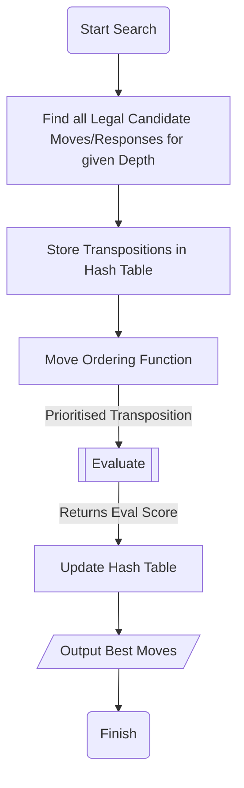
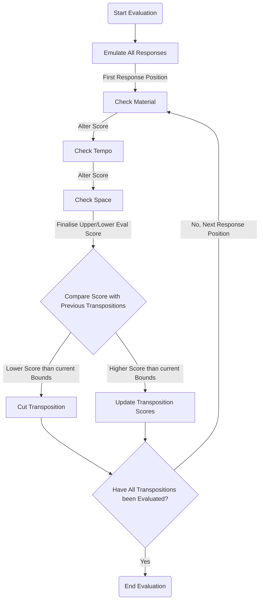
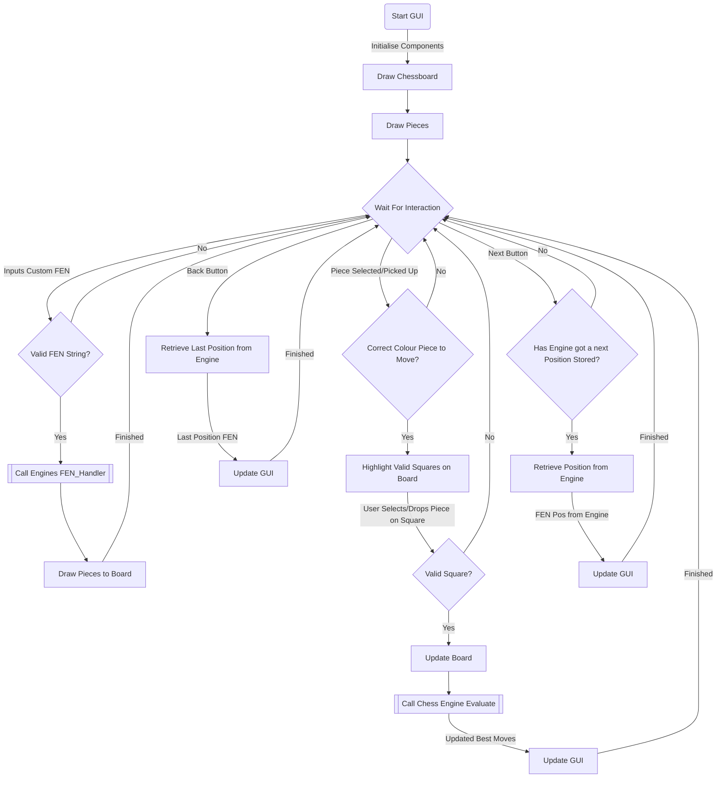
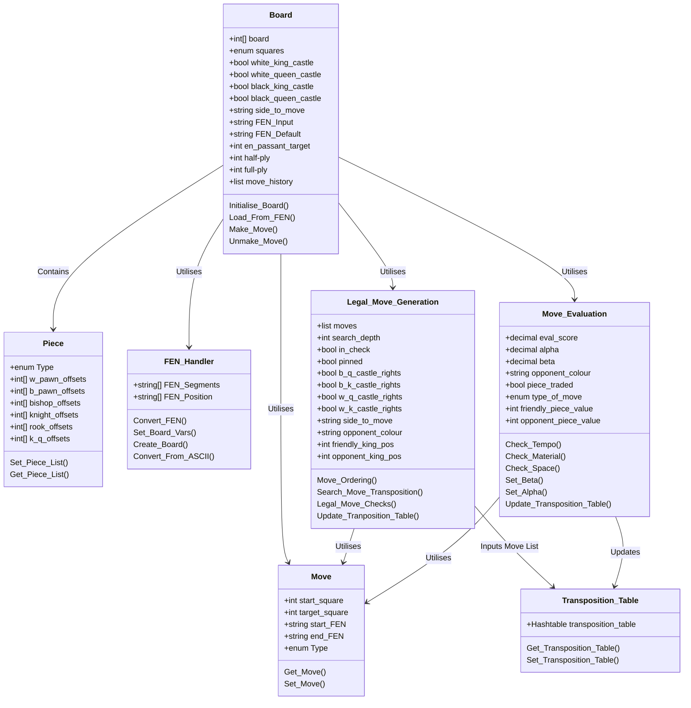

# IP40: The Individual Project Module (U10834) <!-- omit in toc -->
# Chess Engine Project <!-- omit in toc -->
## Will Castleman (wc104) <!-- omit in toc -->

## Table Of Contents <!-- omit in toc -->
- [Introduction and Idea (5marks)](#introduction-and-idea-5marks)
  - [Background to Problem](#background-to-problem)
  - [Justification to Task](#justification-to-task)
  - [Project Links](#project-links)
- [Project Analysis (20 Marks)](#project-analysis-20-marks)
  - [Stockfish - Basics](#stockfish---basics)
  - [Stockfish - Move Generation](#stockfish---move-generation)
  - [Stockfish - Move Evaluation](#stockfish---move-evaluation)
  - [Benefits of AI Neural Networks](#benefits-of-ai-neural-networks)
  - [Implementation Anlaysis](#implementation-anlaysis)
    - [Resource Estimation](#resource-estimation)
    - [Board Representation](#board-representation)
    - [Board Notation](#board-notation)
- [Design](#design)
  - [Flow Charts](#flow-charts)
  - [Class Diagram](#class-diagram)
  - [Sequence Diagram](#sequence-diagram)
  - [Project Planning](#project-planning)
- [Testing](#testing)
- [Conclusion](#conclusion)
- [Appendix](#appendix)
  - [Appendix A: Engine Framework Flowchart](#appendix-a-engine-framework-flowchart)
  - [Appendix B: Engine Search Algorithm Flowchart](#appendix-b-engine-search-algorithm-flowchart)
  - [Appendix C: Engine Evaluate Algorithm Flowchart](#appendix-c-engine-evaluate-algorithm-flowchart)
  - [Appendix D: Graphical User Interface Project Flowchart](#appendix-d-graphical-user-interface-project-flowchart)
  - [Appendix X: Engine Class Diagram](#appendix-x-engine-class-diagram)
- [Glossary](#glossary)
- [References](#references)

## Introduction and Idea (5marks)
### Background to Problem
This project is about creating a chess engine that will be able to play a decent game of chess by the end. Chess players would typically use it to analyse positions for insight. It may also train players up to a specific Elo rating, and finally, it could also be played for a bit of fun. It will be programmed in C# and will mainly run on a desktop computer, and if there is time at the end of the project, it will also be available to access on the web.

### Justification to Task
I chose to take on this project not only because of my interest in the game itself; but also the personal growth and development I will get out of it as a programmer. It will be one of the most significant projects I have taken on solo. I will have to deep dive into some complex searches and evaluate algorithms that make up the main bulk of this project. The project is not only a task well suited to computers, but these algorithms' fundamental principles could be helpful in many other domains. Additionally, my time management and prioritisation skills will be challenged due to the different moving parts of this project.

One of the main reasons I chose this project was the advanced understanding I will develop due to deep-diving into researching these fundamental computing algorithms and concepts. There is also an enormous scope of other domains that benefit from applying these algorithms.   Examples of a few sectors which benefit from these algorithms include:
- Finance
- Chemical
- Gaming
- Databases and big data
- Travel 

### Project Links
- [GITHUB](https://github.com/willcgg/Chess_Engine_Project)
- [TRELLO BOARD](https://trello.com/b/KsboK28s/project-backlog)

## Project Analysis (20 Marks)
Traditionally most chess engines follow the exact blueprint:
- Finding all legal candidate moves
- Iterating through a tree of potential moves to a given depth
- Assessing the tree to find the best move

An engines quality is usually evaluated based on two criteria:
- Speed - How fast it finds a list of potential 'good' moves
- Accuracy - How fast it finds the best move out of these moves

One of the first commercially available chess engines to exist by Dietrich Prinz (1951) on a Ferranti Mark 1 at the University of Manchester. The Ferranti Mark 1 lacked power, so it was limited because it could only find the best move when a position was two moves away from checkmate. The next engine the world saw was by a gentleman named Bernstein (1957). It was the first complete chess engine to run on a computer (IBM 704), which could play a game from start to finish, taking roughly 8 minutes to make a move. It was a type B implementation, a selective technique that attempts to cut processing times by examining variations as far as possible. Then only evaluating when a reasonable amount of instability in the position is detected. It then prunes unnecessary, redundant variations to cut processing times further. It is then run through a function to evaluate the position's stability (e.g. en prise). See Figure 1 for a "Crude definition" of this type of algorithm. (Bernstein, 2022; Chessprogramming.org, 2022)


Figure 1: A "Crude definition" of an en prise algorithm

Since then engines have developed significantly with engines such as:
- AlphaZero
- Stockfish
- Leela Chess Zero
- Houdini

Each demonstrates a different approach to the classic problem. Three of these engines were written in C++, while AlphaZero was developed in Python. Leela Chess Zero, much like AlphaZero, relies on AI and the use of a self-taught neural network to evaluate and generate the best moves. The engine plays against itself millions of times to teach itself the best move generation. These engines focus much more on selection/evaluation than on the 'winning routes' rather than the more typical brute force search we see in solutions like Stockfish. This project will look into more brute-force type algorithms with additional refining algorithms to 'trim' the search down. (Chess Engine | Top 10 Engines In The World, 2022)

### Stockfish - Basics
Stockfish, one of the most potent and well-known engines available to the public, was developed over several decades with the input from several chess grandmasters and many other sources. It used to be a classical brute force implementation that analysed millions of positions per second for optimal moves, defined by countless human input. However, since the famous loss against AlphaZero spoke about below, they implemented AI and machine learning aspects to enhance the engine further and cut processing times. (Champion, 2022)

Stockfish stores the board in a bitboard fashion with an array of 64 bits, with each representing a square on the board (see figure 2). If the bit representing a square has a value of one, there is a piece occupying it. This way, it is easy to represent a moved piece through bitwise operations: 
- One square forward: left shift of 8 bits
- One square left: left shift of 1 bit
- Retrieving all pieces currently on board: Logical OR of all the individual bitboards together
- Checking if a square is occupied: Logical AND of the bitboards with the positional mask of the selected square
- E.t.c...


Figure 2: Little-Endian File-Rank Mapping

### Stockfish - Move Generation
Next, I will go over how the engine generates its list of candidate moves. Some pieces, for example, the knight, have fixed candidate moves due to their movement, that being in an 'L' shape, with three squares forward and one square left (see Figure 3). (Champion, 2022)


Figure 3: Knight piece movement example

Variables containing bitshift operations are stored for knights' movement; they contain all eight operations required to move the knight in any direction. This works for most knight movements except for those where it is near a side of the board. A mask is applied to ensure no moves where the piece lands off the board are generated in these circumstances. A safe destination method is run after generating all pseudo-legal candidate moves to eliminate those that are invalid off-board positions. Pseudo legal move generators look for all empty square moves possible given a board position. It ignores most scenarios listed below. Once the moves have been generated, it runs a 'bool Position::legal(move m)' method alongside 'position.cpp', which tests whether the moves generated are legal. (Champion, 2022) The method checks for scenarios such as: 
- Blocking pieces 
- Discovered checks 
- Pinned pieces 
- E.t.c...

For the other sliding pieces: rooks, bishops, and the queen. Candidate moves are a little bit more problematic due to the sliding nature of the pieces' movement; they can move an indefinite amount of squares in their available attacking rays depending on whether a piece is blocking. To accomplish move generation of these pieces, a combination of the chosen pieces attacking rays and the complete board representation needed to be AND'd together to find these blocking pieces (see figure 4). Although this can be done in run-time for each piece and each attacking ray direction they can move, it is computationally expensive to do so. Therefore Stockfish uses a slightly more efficient method by using the look-up method in an array containing all the candidate moves for the sliding piece. However, finding all blockers for the piece is still required. (Champion, 2022)


Figure 4: Sliding piece move generation; blocking pieces

Once the blockers board has been found, Stockfish combines this with the existing array containing the candidate moves to generate the actual candidate moves for the piece (see figure 5 below).


Figure 5: Finding legal candidate moves for sliding pieces

However, this method has a problem because the blocker piece board is a 64-bit array. The array containing the candidate moves will have up to 264 elements. These combined works out at about one exabyte in size, much larger than any modern memory can hold at once. Stockfish uses a hashmap to store the candidate moves more memory efficiently to solve this issue. This brings the candidate move array down to only a few hundred kilobytes, easily handled by most modern computer systems. For a diagrammatic summary of all described above, see figure 6. (Champion, 2022)


Figure 6: Summary of Stockfishes process to generating a move list

### Stockfish - Move Evaluation
Once Stockfish has generated its set of possible legal moves, it needs to evaluate to return the best possible move for this set. Until 2018 when AlphaZero, spoken about below, drastically outperformed Stockfish, Stockfish relied solely on a classical evaluation of the position to retrieve the best move. Since then, they have integrated a neural network to assist in evaluations of more balanced positions to close the gap. For this next section, I will be focusing more on the classical evaluation and later look into the benefits brought by AI.

Without neural networks, Stockfish's classical evaluation relies on pro chess concepts such as:
- Tempo
- Material
- Space e.t.c

The evaluation function essentially combines chess concepts and strategies input by chess professionals and Grandmasters over several decades. It essentially evaluates things such as but not limited to the following parts along with examples:
- Material:
    - Imbalance - How many pieces left
    - Advantage - Strength of pieces e.g. bishop pair
    - Positional - How strong the pieces are in the current position
- Strategy
    - Advantage for pawns e.g. - Doubled pawns, isolated pawns, connected pawns, supported pawn structure, attacked pawns e.t.c
    - Advantage for pieces e.g. - Blocked pieces, bishop x-ray attacks, bishops on long diagonals such as C4 for light-squared bishop, trapping pieces, rook, and queen battery, keeping rooks on open files, forking pieces, e.t.c
- Space - Controlling more squares than the opponent
- King Safety - Looking out for incoming checks, keeping king 'sheltered' e.g. castling

This will make up the main bulk of what makes up these engines and what differentiates them from others; it essentially makes up the 'personality' of the engine and how it plays. Due to Stockfish's open-source nature, there have been countless pull requests just editing some of the weights and scores of some of these functions, which usually entails minor Elo rating improvements. (Champion, 2022)

### Benefits of AI Neural Networks
Historically some of the most potent engines have implemented aspects of AI, for instance, Google's AlphaZero, which introduced neural networks to the chess programming world. AI demonstrated its supremacy over other engines when it came out victorious in its hundred-game match against the well-known Stockfish 8. At the time of this match, it could beat even the top players in the world. This matchup was played with three hours of playtime with a 15-second increment. Both engines had time to evaluate positions thoroughly and to the best of their abilities, making any arguments of time limitations playing to either of the engine's disadvantages obsolete. (Pete, 2022)

AlphaZero even soundly won against the traditional engine in a series of time-odds matchups with a surprising time odds of 10:1. This means that AlphaZero even won with ten times less time than Stockfish (see figure 4). Furthermore, to take it further, the machine-learning engine even won matchups with a version of Stockfish with a "strong opening book". It did win a substantial number more games when AlphaZero was playing as black. However, it was not nearly enough to win the overall match (see Figure 5 for results). These victories over the strongest of traditional chess engines show just how powerful AI can be in both: 
- Evaluating moves 
- Searching for moves

DeepMind released information suggesting AlphaZero uses a Monte Carlo tree search algorithm to examine around 60,000 positions per second. Compared to Stockfishes, 60 million per second, demonstrating its much higher efficiency in generating its move set. (Pete, 2022)


Figure 7: AlphaZero's results in time odds match against Stockfish engine


Figure 8: AlphaZero's match-up results against Stockfish with a "strong opening book". Image by DeepMind.

These results safely conclude that AI and machine learning are superior to traditional engines and have solidified their place in the game and engines today. (Pete, 2022)

### Implementation Anlaysis

#### Resource Estimation
Take a starting chessboard, for example (see figure 9); for white, there are 20 total possible starting moves they can take. 2 possible moves for each of the pawns and 2 for both the knights ((8x2) + (2x2) = 20) then same for black. This means that after both players make their first move, there are 400 different possible positional outcomes. 


Figure 9: Starting chess position

After each move, there are more and more possibilities for where each player can move their pieces. This means the number of possible positions grows exponentially; to put this into perspective, see figure 10. Hence, we create trees to hold all the available moves down a given path. (Hercules, A., 2022)


Figure 10: Number of variations with incrementing the half-ply count

With these figures, it is possible to estimate how long the system will be able to calculate the best moves for a position x number of half-plys. For the following calculations, the assumptions made are that only one core running at 3GHz is being used to analyse a position. Roughly 1,000 instructions are being sent to the CPU to evaluate each position fully.
- 2 ply : ~ 0.0003s
- 3 ply : ~ 0.009s
- 4 ply : ~ 0.27s
- 5 ply : ~ 8.1s
- 6 ply : ~ 243s / 4m 3s
- 7 ply : ~ 7,290s / 2hrs 1m 30s
- 8 ply : ~ 218,700s / 60hrs 45m

#### Board Representation
There are many ways to approach the board representation in this project such as:
- Piece Centric
  - Piece-Lists
  - Piece-Sets
  - Bitboards

These implementations typically hold a collection of pieces still on the board with information such as square occupied, typically held in lists or arrays. Doing it this way comes with the benefit of avoiding scanning the board for move generation purposes saving processing time. 
- Square Centric
  - Mailbox Approach
    - 8x8 Board
    - 10x12 Board
    - Vector attacks
    - 0x88

These types of implementations typically hold the opposite of piece-centric approaches in how they hold pieces of information on squares on the board. For example, an array of squares on the board is created to hold information on whether there is a piece occupying it or if it is empty.

- Hybrid Solutions

As discussed above, some of these types of implementations may also use elements of both of these types of implementation hence the 'hybrid'. Different search and evaluation functions tend to favour a specific representation; however, it is still common to see both in today's solutions.

I have chosen to represent the board in memory with the 0x12 mailbox approach. This is a 2D array of 120 slots in size; 64 positions in the middle of the array represent the board squares and pieces, and the remaining surrounding files and ranks represent sentinel pieces (see figure 11).


Figure 11: 10x12 Mailbox approach example

I chose to do it this way rather than the traditional 8x8 approach to ensure all knight jumps, even from the very corner of the board, end up on valid array positions. For example, when a knight is on square A8, it can only jump to squares B6 and B7. Otherwise, it would end up in positions highlighted in red squares in figure 12, not on the board. Every knight's move ends up with it still on a valid array index; this is useful as it will avoid errors in the engine's search and evaluate algorithms where knights are on bordering squares. The code will need to check that the index the knight lands on is not '-1' as this is a blocker piece. The knight cannot land there if it is, as it is not a legal move. (Chessprogramming.org. 2022)


Figure 12: Extreme knight movement example: Red squares represent invalid psuedo legal moves, blue represents legal moves, and green represents knights current square position.


Figure 13: Movement vectors for 10x12 array representations example

#### Board Notation
Alternatives to normal FEN include PGN, compressed FEN, and ųFEN. Alternatively, a custom conversion script to convert FENs to a human-readable text created a chessboard with ASCII pieces to clearly show the state to the user. This would probably be the least efficient way to go about it; however, it gives the project ease of readability. Therefore, testing will become a lot easier.

Compressed FEN could be good for saving bytes and be more memory efficient in the system. However, it does not meet project goals. It arguably is worse for humans to read than normal FEN, which is the purpose of this alternate board state storage.

https://www.chessprogramming.org/Transposition_Table

ųFEN could be interesting as it considers a single square and its different states. There are 14 states with the different pieces, empty squares, and the blocker piece. This means the board could be represented in (4bits x 64 squares) 256bits. Compared with normal FEN, which has a worst-case scenario of 712 bits (r1b1k1n1/1p1p1p1p/p1p1p1p1/1n1q1b1r/R1B1P1N1/1P1P1P1P/P1P1K1P1/1N1Q1B1R w KQkq e3 999 999), almost 3 times less efficient. However, in practice, without compression techniques, which I do not wish to go into in this project, it ends up less memory efficient than compressed FEN.

https://chess.stackexchange.com/questions/8500/alternatives-to-the-fen-notation

PGN will need to be stored regardless, mainly to complete the functionality of the 'Next' and 'Back' buttons. This will be implemented through either a stack of all the moves made in the game or a list. Then when a user wishes to go back to a position, it will simply pop the top move off of the stack/list, which will be the last move played due to the stack's nature in storing data.

## Design
The language I will be using to produce the engine will be C#. This is for several reasons such as familiarity, portability, object-oriented nature, and finally, it is a static language. This makes it easier to find errors, understand the code, and write it. C#'s main advantage is that it is an object-oriented language; this makes the code highly efficient, reusable, flexible, scalable, and easy to maintain. Additionally, the chess programming world is primarily dominated by C and C++ languages, meaning a vast community of developers and resources are available. Even some of the most robust engines written in other languages were eventually rewritten in C. For example, Booot written by Alex Morozov in Delphi was rewritten due to running into too many 64-bit bugs. It is also commonly used for web and windows applications which fits the project's needs. 

### Flow Charts


### Class Diagram

### Sequence Diagram

### Project Planning

[](https://mermaid.live/edit#pako:eNptklFLAzEMx79K6INPO9idgvPe1G0ycCrqEOFA6prdKr30aHPKEL-73fXObWqeSvJL_kmaT7G0CkUuSknMBUEw1mwQLtfo_cuESk34cufsGy4ZHnWFJjgiqCTj1LpKMsBzsGQ-T8bjGPMB15bgET1rKqPzTuMSYUGaW7-HPBtmaTI8S7LRALKRitiFlU4dYmkXmk5u9gMAeXqiDhWvFrPoGGtfG7npyh1F9ZATRdM0OR4O4LTLntt3lK9h7p7qbFf_3Bj7AbdkNnCNpTRtit8nZlQ3DA8c1gIa2167Gn37l2tJJYJvkT3b1eibPpBoiezXnPFr9jd2j7VDjxSqbwGIo2aHaU9OB-1FHb3d98Bv-_9jZsTOqiYWkqRgplC2dE_0h3JO0my8_tljPhr2A6LXJcFfxbOe2JoYiArDZWkVbvNz6y8Er7HCQuThqXAlG8OFKOgroE29PcWJ0mydyFfSeBwI2bB92NBS5Owa7KGxlqWTVUd9fQM87eDS)

## Testing

## Conclusion 

## Appendix

### Appendix A: Engine Framework Flowchart

Figure X: Chess Engine Program Flowchart
[](https://mermaid.live/edit#pako:eNplksFuwjAMhl_FisRO4wU4bBptgaKxwxjskKLhUQPR2gQlLtPU8u5L06Ihrae2_-ff9p_UYmdyEiMxGNTbRB-UJpgU5huiI1reXgaDTB8sno7wFmca_PMkl-wl6OANDIcPTaoVKyyUowbGckkMMe2xKhjWaBV-FuQ2XfW45SGSkSVkgrFBm8OTtfjTA1EAYuld0O6OHbHpxTh0m5Im66sdLMyZ4Fk5bmAuZXLGompd98bCmBwH3V2L58E5qd9RcUBS7dhWO1ZGXzokCf4rR614qthBVDk2JUySlwYm8m_P9s_HDHVeeDYq0F0XnIQuUxkZfSYf058BLNkqfei5aWjVRnUHr8SV1X0YPjHXQPxvoAV-9Rs3MKvXfoocSv_12M8-60_iHJSOS26l9Y2QSrk65W1W01V6DSjtohf3oiRbosr9tahbKRN8pJIyMfKveXeymcj0xaNVsElyxcaK0R4LR_cCKzbLH70TIx8wXaFYob9KZU9dfgERZM2k)

Mermaid Code in case edits required:
```mermaid
%%{`Engine Flow Chart`}%%
graph TD
    A[Start Engine] -->|Initialise| B[Set Default Variables]
    B --> C[Create Board Array]
    C --> D[[Search Board]]
    D -->|Generates Move List| J[[Evaluate for Best Moves]]
    J --> E{Wait for Instruction}
    E -->|User Inputs Custom FEN| F[Initialise FEN_Handler Class]
    F --> G[Convert Custom FEN String]
    G -->|Set & Return Board Vars| D
    E -->|User Makes Move| H{Valid move?}
    H -->|Invalid Move| E
    H -->|Valid Move| I[[Update GUI]]
    I --> D
```
### Appendix B: Engine Search Algorithm Flowchart

Figure X: Chess Engine Search Board Function Flowchart

[](https://mermaid.live/edit#pako:eNplkc1qwzAQhF9l0amBhNx9KDSxnRZaUuL0JOewtTa2QJaMfgIlybtXVtVDqU5C-83s7OrKOiOIFay3OA1wLFsN8Tw9NB6th4bQdsMiP8Jq9QgbXkstAJWCV-pRwRa1kAI9wZu5kFsfyE1GO3JwNhZ6eSENJU1-OP3YbJLNljfeWIKjRR15J72MIpAantHFIPipKAu2SVDy2R72VpCVuoc66G7WZKicodu7lcZGK0fir_MNKs6rC6oQg56ypkqaA_lgY-u5Ck0XQ92g5h9TGulfmDqF2fH1PvgpeNiQ83nwTOwS8fIQ1yTdsGBLNpIdUYq45euMtMwPNFLLingVdMagfMtafY9oSG0rIeNyWHFG5WjJMHjTfOmOFd4G-oVKifHTxkzdvwEtgJZZ)

Mermaid Code in case edits required:

### Appendix C: Engine Evaluate Algorithm Flowchart

Figure X: Evaluate function Flowchart
[](https://mermaid.live/edit#pako:eNp9kstuwjAQRX9l5BWVQN2zaAUhPKoWoQKLinQxTQZi1bEjP6AV8O91YlMJUdWr2D73zs2MjyxXBbE-22msS1iNMgl-DTpLi9pCukfh0HIl7-IF9HoPMNyklRNoCQZCwCuZWklD5j0ww4Y5jbk29vcOFsrwxucEySYpKf-EF6_XHEVUJa1qIPwhLHOl6QSjSK6oqlXERrdYGrFljTlFLI0ZJAruq6_rmvT9szp4VfNPF-n4mKiqRk3hAA7clrDQtOfKGVhplD5-CG7OwXncOgerILIlSsid1iQtDJWThTnBZJM4e-0Qo03aFs6OU9yH_l2XgQ8ieWk8FY9XZad8V_5fd7pZ10UzmSvXoLgMaBoShM2sNX4jr33qpLK4nXkg5qoLc_r6e6SsyyrSFfLCP6VjI8uYLamijPX9Z0FbdMJmLJNnj7o2YVpwqzTrb1EY6jJ0Vi2_Zc76Vju6QCOO_mVWkTr_AL9W5lo)


Mermaid Code in case edits required:

### Appendix D: Graphical User Interface Project Flowchart

Figure X: Project GUI Flowchart
[](https://mermaid.live/edit#pako:eNp9VF1vm0AQ_CsrnlopUd790KqAP2M7xNSpKjuqrtzaPgXu6N3itgL_9x4H-CtWkZCAnZ2dGRZKL1EcvZ631SzfwddwLcEeXz7ExDTBcDn-CPf3n6qxFCRYKgxCoLJcSZRkKvBXoWa_IdihMT8V0_y16ffrJgiaaiQwQdNWAlcJy29MEAyUhrEk1CwhoeShgYTtxLwgA0FhSGUw6M8r6JcvVgKvbyAmLeT2c9vSdy3f0UoarFYBS1Poy62QaGrwjxGTPEX92moYOA3Dc3VACvwzA0NHOBBSmB3yCsLzOXN1fNBodRwQY4oJIX-IRPKGHJZ5BaMyUFrbxza2VBW6GVdPm6k9dvJH17Sjk5_xaiS2u9SeBI39-FfBtJWs5IXksetZGtStEvMQapWbdqRFN40VTMpzok7E5DTzcbXMOSO84H90qU3beN0rb0OG_p6lhcV3AU8bKY6Dg4-GnF3LPOuY7Wa14NntqCe3o_ZZ8gZ-QaRkBfPVAu0e4B5hyuyQSBlRLxJstN2ZRlw7Ze66L1FuqZ7eK3q6ragRMMc_dBQQlSN2TGGrCBjIun4cEZPSyLuIo2tP0Snz55OX_9h4bqTZD8CCzusVLN4bWVwb8e68DHXGBLeffFmD1h7tMMO117OXHDesSGntreXBQgvH1-fCmvB6G5YavPNYQSr-KxOvR7rADhQKZv8gWYs6_ANejWVE)

Mermaid Code in case edits required:


### Appendix X: Engine Class Diagram

Figure X: Engine's Class Diagram
[![](https://mermaid.ink/img/pako:eNqVVslu2zAQ_RVBpxZNfsCHAqmzGUjaAHZ6aQpiLI0twhSpkFQMw8i_d0h5ESnaSX0y5s1wljeLtnmhSsxHeSHAmGsOSw31i8zo90OBLrPLy-_ZE8cCs1E2VtIClybGb29-snuQpUBNWs-WC25woPWo3vAM_IBLEMwpsTuUqMFyJT94jt28gWjTmun3nOVMgzSNMtxJ2AzmwsU1kU1rTRflAze2eyX2ctr-uSnBfuw8WYWUl5Rip-2p6iqx7SRZ9o1L--dvNnfCgwxlW2fmtQW9d0TCuVIiW1fcIltxuWQFGCswBb-2iDKJzwUUq9PmHZw0N1aTVWZ4icwqVlOSMea6yZORAq5xAa2w_bQz8tJQRUBaZkEvMUQrEIvLRmwC4aIVIhBSjW3momEV_VP6gEwk0QyOAuYr_uXrHnlQULJbrWpGgR3Fj7BCz_xR9CzrWPjep9LP1zakbbZpMCJ3TWmuJVOLhUFrYubPgtxUqjkBriRfVvYEqJVanbJjrzEyRct8MsxN0LEAd0l5UIPeDjlU4kA9eXP4FJc1yqO7GH_azeQRp431htqGDHVxejbZb9Cmj4w10hTHVPcecnxfTceTSZRFP5fk9PezOnRbPxXXlwZBFxUrsbFVD_JTxWmYKixWsbzhUmIZS-fETjd7TDt-zVBhdV5h_dEL6zMvnJnzI6qaRkkilBVKqFZHtVhojtQPm27P0L6N8IP1EPel_6VLdG5C4n19PR6s8b5Sj76xK3jQIN2a98bhCUh2dbTY-z1QYsFrEBkSykyhNCZAEE0FCfkcLfxPPXeN4ibQaiiDdvHrxtK6oWmOiQp46OxdMniKiqSKLyKbYd2oYKS8-JGqqWnBDpFpAwUOppYSj2VXrkgnODKfICmh1yfqHkxl_ZG3gaKXHfXcjjvjcR_sZ4NynbONtwOdN8u6gx5B3eEbYvs59Ja0BYcQcRsBg_vTJRfetC6b4KTlF3mNugZe0vekj_0ltxXW-JKP6G-5O935i3SqrSfppuR0bfPRAoTBixxaq6YbWeQjq1vcK-0-S3da7_8AnWxmNA)](https://mermaid.live/edit#pako:eNqVVslu2zAQ_RVBpxZNfsCHAqmzGUjaAHZ6aQpiLI0twhSpkFQMw8i_d0h5ESnaSX0y5s1wljeLtnmhSsxHeSHAmGsOSw31i8zo90OBLrPLy-_ZE8cCs1E2VtIClybGb29-snuQpUBNWs-WC25woPWo3vAM_IBLEMwpsTuUqMFyJT94jt28gWjTmun3nOVMgzSNMtxJ2AzmwsU1kU1rTRflAze2eyX2ctr-uSnBfuw8WYWUl5Rip-2p6iqx7SRZ9o1L--dvNnfCgwxlW2fmtQW9d0TCuVIiW1fcIltxuWQFGCswBb-2iDKJzwUUq9PmHZw0N1aTVWZ4icwqVlOSMea6yZORAq5xAa2w_bQz8tJQRUBaZkEvMUQrEIvLRmwC4aIVIhBSjW3momEV_VP6gEwk0QyOAuYr_uXrHnlQULJbrWpGgR3Fj7BCz_xR9CzrWPjep9LP1zakbbZpMCJ3TWmuJVOLhUFrYubPgtxUqjkBriRfVvYEqJVanbJjrzEyRct8MsxN0LEAd0l5UIPeDjlU4kA9eXP4FJc1yqO7GH_azeQRp431htqGDHVxejbZb9Cmj4w10hTHVPcecnxfTceTSZRFP5fk9PezOnRbPxXXlwZBFxUrsbFVD_JTxWmYKixWsbzhUmIZS-fETjd7TDt-zVBhdV5h_dEL6zMvnJnzI6qaRkkilBVKqFZHtVhojtQPm27P0L6N8IP1EPel_6VLdG5C4n19PR6s8b5Sj76xK3jQIN2a98bhCUh2dbTY-z1QYsFrEBkSykyhNCZAEE0FCfkcLfxPPXeN4ibQaiiDdvHrxtK6oWmOiQp46OxdMniKiqSKLyKbYd2oYKS8-JGqqWnBDpFpAwUOppYSj2VXrkgnODKfICmh1yfqHkxl_ZG3gaKXHfXcjjvjcR_sZ4NynbONtwOdN8u6gx5B3eEbYvs59Ja0BYcQcRsBg_vTJRfetC6b4KTlF3mNugZe0vekj_0ltxXW-JKP6G-5O935i3SqrSfppuR0bfPRAoTBixxaq6YbWeQjq1vcK-0-S3da7_8AnWxmNA)

Mermaid Code in case edits are required:



## Glossary
Key:

Word - Meaning

Transposition - A transposition in chess is a sequence of moves that results in a position which may also be reached by another sequence of moves. For instance 1. d4 e6 2. e4 versus 1. e4 e6 2. d4, or {6. cxd4 exd4 7. exd4} versus {6. exd4 exd4 7. cxd4}. At least two moves (three plies) are necessary to transpose by exchanging moves, the more plies, the more possible sequences with transpositions are possible. https://www.chessprogramming.org/Transposition

## References 
Chess.com. 2022. Chess Engine | Top 10 Engines In The World. [online] Available at: <https://www.chess.com/terms/chess-engine> [Accessed 11 February 2022].
(the_real_greco), A., 2022. Understanding AlphaZero: A Basic Chess Neural Network. [online] 

Chess.com. Available at: <https://www.chess.com/blog/the_real_greco/understanding-alphazero-a-basic-chess-neural-network#:~:text=This%20just%20means%20that%20a,be%20used%20in%20an%20engine.> [Accessed 11 February 2022].

Historyofinformation.com. 2022. Alex Bernstein & Colleagues Program an IBM 704 Computer to Defeat an Inexperienced Human Opponent : History of Information. [online] Available at: <https://www.historyofinformation.com/detail.php?id=5508> [Accessed 11 February 2022].

Chessprogramming.org. 2022. Type B Strategy - Chessprogramming wiki. [online] Available at: <https://www.chessprogramming.org/Type_B_Strategy> [Accessed 11 February 2022].

Chessprogramming.org. 2022. Languages - Chessprogramming wiki. [online] Available at: <https://www.chessprogramming.org/Languages#:~:text=Chess%20programming%20is%20dominated%20by,bugs%20in%20the%20Delphi%20compiler.> [Accessed 14 February 2022].

Hercules, A., 2022. How Does A Chess Engine Work? A Guide To How Computers Play Chess - Hercules Chess. [online] Hercules Chess. Available at: <https://herculeschess.com/how-does-a-chess-engine-work/#:~:text=So%20how%20does%20a%20chess,with%20no%20graphics%20or%20windowing.> [Accessed 14 February 2022].

En.wikipedia.org. 2022. Forsyth–Edwards Notation - Wikipedia. [online] Available at: <https://en.wikipedia.org/wiki/Forsyth%E2%80%93Edwards_Notation> [Accessed 6 March 2022].

Chessprogramming.org. 2022. 10x12 Board - Chessprogramming wiki. [online] Available at: <https://www.chessprogramming.org/10x12_Board> [Accessed 21 March 2022].

Champion, A., 2022. Dissecting Stockfish Part 1: In-Depth look at a chess engine. [online] Medium. Available at: <https://towardsdatascience.com/dissecting-stockfish-part-1-in-depth-look-at-a-chess-engine-7fddd1d83579#:~:text=Stockfish%20is%20actually%20performing%20the,blocking%20pieces%20or%20discovered%20checks.> [Accessed 29 April 2022].

Champion, A., 2022. Dissecting Stockfish Part 2: In-Depth look at a chess engine. [online] Medium. Available at: <https://towardsdatascience.com/dissecting-stockfish-part-2-in-depth-look-at-a-chess-engine-2643cdc35c9a> [Accessed 29 April 2022].

(Pete), P., 2022. AlphaZero Crushes Stockfish In New 1,000-Game Match. [online] Chess.com. Available at: <https://www.chess.com/news/view/updated-alphazero-crushes-stockfish-in-new-1-000-game-match#games> [Accessed 29 April 2022].
